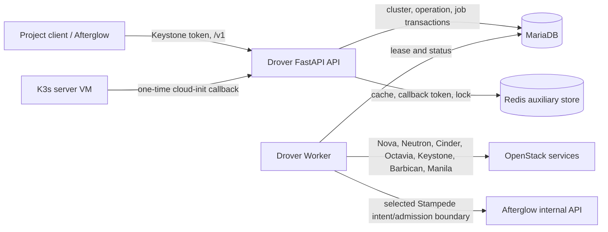

# Drover Architecture

## Overview

Drover는 OpenStack 프로젝트 단위로 K3s 클러스터와 노드그룹의 생성·운영·삭제를 담당하는 독립적인 control plane 서비스다. Afterglow가 화면과 외부 BFF를 소유한다면 Drover는 `/v1` API, 내구성 작업 큐, OpenStack 자원 inventory, VM callback 이후의 K3s 조정을 소유한다.

- Repository: https://github.com/openstack-afterglow/drover
- 분석 기준: `dev` 브랜치, 작업 트리의 소스와 테스트
- 패키지: `drover==0.2.23`, `drover-sdk==0.2.21` (별도 SDK 버전)
- 주요 런타임: Python `>=3.11`(root package `requires-python`; SDK는 `>=3.12`; CI·container image는 3.12), FastAPI `0.141.1`, Starlette `>=1.3.1`(lock `1.6.0`), Uvicorn `0.39.0`, openstacksdk `3.3.0`, SQLAlchemy `>=2.0`, Redis client `5.0.0`

1분 요약: FastAPI API가 MariaDB에 cluster/operation/job을 함께 기록하고, 독립 Worker가 lease를 얻어 OpenStack 작업을 실행한다. 서버 VM의 일회성 cloud-init callback은 K3s bootstrap 결과를 전달하고, Worker가 agent/HA 후속 작업을 수행한다. MariaDB는 내구성 상태와 queue의 정본이며 Redis는 callback token·짧은 상태/헬스 캐시·분산 잠금·stampede 이벤트 같은 보조 저장소다.

## Development status

| 기능 | Implementation | Verification evidence | Current limit | Source |
|---|---|---|---|---|
| Native `/v1` API와 Keystone 프로젝트 격리 | implemented | source-reviewed, test-defined | Magnum wire 호환 API가 아니다 | `drover/main.py:127-143`, `drover/auth.py`, `tests/test_auth.py`, `tests/test_openapi_contract.py` |
| 내구성 cluster create와 operation ID | implemented | source-reviewed, test-defined | 외부 operation ID/idempotency 계약은 create API에만 있다 | `drover/api/clusters.py:create_k3s_cluster_async`, `drover/services/jobs.py:enqueue_job`, `tests/test_durable_create.py` |
| lease worker와 retry/attempt fence | implemented | source-reviewed, test-defined | 최대 3회 시도 후 실패하며 원격 API의 모든 작업을 되돌린다고 보장하지 않는다 | `drover/services/jobs.py:_claim_one`, `process_one_job`, `tests/test_jobs.py` |
| cloud-init callback 및 HA/agent handoff | implemented | source-reviewed, test-defined | callback 만료/실패는 cluster를 `ERROR`로 만들며 callback token은 Redis 일회성이다 | `drover/api/callback.py:k3s_callback`, `drover/services/provisioner.py`, `tests/test_k3s_callback.py` |
| nodegroup·Stampede autoscale | implemented | source-reviewed, test-defined | `min_size`/`max_size`와 cooldown 범위 안에서만 동작하며 외부 GPU admission에 의존한다 | `drover/services/autoscale.py`, `drover/services/stampede.py`, `tests/test_k3s_stampede.py` |
| OpenStack drift reconciliation | implemented | source-reviewed, test-defined | orphan은 보고만 하고 자동 삭제하지 않는다 | `drover/services/reconciliation.py:reconcile_cluster`, `tests/test_reconciliation.py` |
| Afterglow provisioning intent/GPU admission 연동 | partial | source-reviewed, test-defined | 일반 create는 Drover가 직접 Nova/Cinder 등을 호출하고 intent/admission은 특정 Stampede 경로다 | `drover/services/afterglow.py`, `drover/services/stampede.py`, `tests/test_afterglow_admission.py`, `tests/test_afterglow_provisioning.py` |
| legacy `gpu_quotas` 제거 | partial | source-reviewed, test-defined | 역사적 `001_baseline.sql` 테이블은 아직 물리 삭제하지 않았고 조건부 runbook만 있다 | `drover/migrations/001_baseline.sql`, `drover/migrations/README.md`, `docs/gpu-quota-table-retirement-runbook.md` |

위 표의 `test-defined`는 테스트가 계약을 정의한다는 뜻이다. 2026-09-26 로컬 FastAPI `0.141.1`/Starlette `1.6.0` 기준 `uv run pytest tests`는 655건 통과·3건 skip이었고(architecture guard 13건 포함), 2026-09-24 `uv --directory sdk run pytest`는 111건 통과했다. skip된 live integration과 실제 OpenStack 배포·외부 서비스 호출은 검증하지 않았다.

## System context



텍스트 흐름은 다음과 같다. 호출자는 Keystone 토큰으로 `/v1`에 요청한다. API는 프로젝트 소유권과 정책을 확인하고 MariaDB transaction 안에서 cluster, operation, job을 기록한다. Worker가 job lease를 획득한 뒤 OpenStack 자원을 만들고, 서버 VM이 callback을 보내면 agent/HA job을 이어서 실행한다. Afterglow는 호출자 UI/BFF와 일부 GPU admission/provisioning intent 경계일 뿐 Drover의 DB나 Worker를 대체하지 않는다.

## Code map

| 경로·심볼 | 책임 | 의존 방향 |
|---|---|---|
| `drover/main.py:app`, `readiness_checks` | FastAPI lifecycle, `/v1` router mount, liveness/readiness | API → DB/Redis/Keystone |
| `drover/api/clusters.py:create_k3s_cluster_async` | policy snapshot, cluster row, durable create job, SSE event replay | API → `services.store`, `services.jobs`, `services.operations` |
| `drover/api/callback.py:k3s_callback` | CIDR 검사, one-time token 소비, callback 상태 기록, HA/agent job enqueue | VM → API → DB/Redis |
| `drover/services/jobs.py` | MariaDB queue enqueue/claim, 15분 lease, heartbeat, retry/complete | Worker → provisioner/autoscale/deletion/reconciliation |
| `drover/services/operations.py` | operation 상태·순서 이벤트·idempotency hash·callback timeout | API/Worker → ORM |
| `drover/services/provisioner.py:create_cluster_job`, `bootstrap_ha_servers`, `provision_agents` | Nova/Cinder/Neutron/Octavia 자원과 K3s userdata 생성 | Worker → OpenStack adapters/cloud-init |
| `drover/services/autoscale.py`, `drover/services/stampede.py` | nodegroup 조정, pod 관찰 기반 Stampede scale-up/down | Worker → jobs, K8s API, optional Afterglow |
| `drover/services/reconciliation.py:reconcile_cluster` | recorded inventory와 실제 OpenStack ID/state 비교, drift 기록 | Worker → inventory/Keystone/OpenStack |
| `drover/services/afterglow.py` | 제한된 provisioning intent와 GPU admission HTTP boundary | Stampede → Afterglow internal endpoint |
| `drover/models/orm.py` | `K3sCluster`, `DroverJob`, `DroverOperation`, event, inventory의 DB schema | SQLAlchemy → MariaDB |
| `drover/migrations/manifest.txt`, `drover/migrations/*.sql` | immutable baseline와 migration ledger | `drover-migrate` → MariaDB |
| `drover/worker.py:_main_async` | reconcile/jobs/health/Stampede loop를 한 Worker process에서 실행 | Worker → services |
| `sdk/drover_sdk/service.py:DroverService` | openstacksdk에 `drover` catalog service와 `container-infra` alias 등록 | SDK → `Proxy` |
| `sdk/drover_sdk/proxy.py:Proxy` | `/v1` REST/SSE 호출, shell ticket 발급 및 operation polling helper | SDK client → Drover API |

## Runtime flows

### Cluster create → callback → ACTIVE

1. `POST /v1/clusters/async`가 request body hash와 선택적 `(project_id, Idempotency-Key)`를 확인한다. 정책·템플릿을 resolve한 뒤 cluster row를 먼저 기록하고, `_jobs.enqueue_job` 내부 MariaDB transaction에서 `DroverOperation(status=QUEUED)`와 `DroverJob(kind=create)`를 함께 기록한다.
2. SSE는 DB의 `DroverOperationEvent`를 순서대로 replay하며 operation ID를 모든 progress event에 싣는다. 연결이 끊겨도 job은 취소되지 않는다.
3. Worker가 같은 cluster에 활성 lease가 없는 경우 job을 claim하고 OpenStack 자원을 만든다. 일반 cluster create는 `drover/services/provisioner.py:create_cluster_job`에서 Security Group, HA이면 Octavia LB/FIP, Cinder boot volume, cloud-init callback token, Nova server와 inventory를 만든다.
4. 서버 VM이 `/v1/callback`으로 성공 결과를 보내면 Redis에서 callback token을 GETDEL 의미로 소비하고 kubeconfig를 암호화해 MariaDB에 저장한다. 단일 master는 `provision_agents`, HA는 `bootstrap_ha_servers`와 joiner callback을 거쳐 agent job을 enqueue한다.
5. agent job이 완료되면 cluster가 `ACTIVE`가 되고 create operation이 `SUCCEEDED`가 된다. callback 실패·누락·30분 timeout은 operation/cluster를 실패 처리한다.

선택한 `key_name`은 API admission에서 요청자 connection으로 공개키를 조회·검증한 뒤 기존 cluster/job `ssh_public_key`에 snapshot으로 저장한다. Worker는 tenant manager 계정으로 Nova를 호출하므로 caller의 keypair 이름을 전달하지 않는다. primary·HA server 및 agent의 Ubuntu cloud-init/FCOS Ignition이 같은 공개키를 설치한다. API/worker가 모두 새 버전이어야 이 계약을 보장하며, named-key job/cluster에 snapshot이 없는 구 데이터는 fail-closed 처리한다. 새 schema나 manager 키페어 리소스는 추가하지 않는다.

신규 클러스터의 기본 NIC는 외부 Neutron provider 네트워크에 직접 연결한다. `drover/api/clusters.py`는 명시적 `network_id`를 `k3s.default_network` 정책과 같은 external-only 검증으로 제한하고 내부망이면 자원·cluster·job 생성 전에 400을 반환한다. 값 생략/빈 값은 저장된 외부망 기본 정책을 사용하며 정책 누락·stale·조회 장애는 503으로 거부한다. 선택한 ID/name은 기존 cluster/job `network_id`와 `resource_policy_snapshot`에 저장되어 primary·HA·agent·nodegroup 경로에서 같은 네트워크를 사용한다. 네트워크 snapshot이 없는 구 create job도 Nova 자동 선택으로 진행하지 않는다. 기존 내부망 클러스터를 자동 이관하지 않으며 DB schema는 바뀌지 않는다.

`cloudinit.py:_build_k3s_network_pin_script`는 생성 네트워크 ID→metadata link→MAC→guest NIC로 `node-ip`, `flannel-iface`, server `advertise-address`를 고정하고 재실행 시 저장된 pin을 보존한다. 추가 내부 NIC는 연결 서브넷 접근에만 사용하며 Ubuntu netplan은 DHCP route/DNS와 IPv6 RA를 거부하고 FCOS NetworkManager는 `never-default`, `ignore-auto-routes`, `ignore-auto-dns`, IPv6 disabled를 적용한다. K3s 내부 Pod 경로는 아래 main-table 예외를 유지한다. 상세 계약은 [`docs/drover-feature-coverage.md`](docs/drover-feature-coverage.md)의 Neutron 절을 따른다.

모든 primary·HA server와 agent userdata(Ubuntu cloud-init, FCOS Ignition)는 `drover/services/cloudinit.py:_k3s_pod_route_files`가 만든 script(`/usr/local/sbin/afterglow-k3s-pod-route.sh`), watcher unit(`afterglow-k3s-pod-route.service`), K3s unit drop-in(`k3s.service.d` 또는 `k3s-agent.service.d/10-afterglow-pod-route.conf`)을 설치한다. image-builder `pbrutil`의 source-address rule(priority 30000)이 가리키는 NIC별 table에는 CNI route가 없어서, node 주소에서 Pod(`10.42.0.0/16`)로 가는 응답이 cni0/flannel 대신 NIC gateway로 나가고 Pod→`kubernetes` Service/API 연결이 timeout된다. drop-in은 K3s가 시작될 때마다 `ExecStartPre`로 priority 29999 `to 10.42.0.0/16 table main` rule을 보장하고 보장하지 못하면 K3s를 시작하지 않는다. watcher는 network manager가 foreign policy rule을 지우면 5초 안에 복원한다. Drover는 `--cluster-cidr`를 바꾸지 않으므로 K3s 기본 Pod CIDR만 대상으로 한다. `tests/test_k3s_pod_route.py`가 네 node 유형의 설치와 ensure의 멱등·fail-closed 계약을 정의한다.

### Reconnection, idempotency, scale/delete

- create에 같은 idempotency key와 같은 canonical request hash를 재전송하면 기존 operation/cluster를 재사용하고, hash가 다르면 `409`다. 이 계약은 `POST /v1/clusters/async`에 한정된다.
- SSE 재연결은 `GET /v1/operations/{operation_id}`와 `GET /v1/operations/{operation_id}/events?since_sequence=N`으로 DB event sequence를 replay한다. SDK `Proxy`는 operation 상태를 조회할 수 있지만 서버 작업을 HTTP 연결 수명에 묶지 않는다.
- `PATCH /v1/clusters/{cluster_id}/scale`, nodegroup 조정 및 일반 delete는 durable job으로 enqueue된다. 현재 이 경로에는 create와 같은 외부 idempotency key 재사용/operation ID 응답 계약이 없다. 호출자는 자동 재시도 대신 correlation ID와 cluster 상태를 확인해야 한다.

### Nodegroups, Stampede, reconciliation

`drover/services/autoscale.py`는 desired nodegroup count를 durable `nodegroup_reconcile` job으로 맞추고, `stampede.py`는 K3s pod pending/resource pressure를 읽어 `min_size`·`max_size`, selector/taint, cooldown을 적용한다. GPU flavor가 필요한 경우 현재 GPU quota/admission authority인 Afterglow의 내부 admission을 조회하고, 특정 Stampede provisioning만 durable Afterglow intent를 claim/submit한다. Worker의 reconcile loop는 active cluster를 프로젝트별 concurrency로 enqueue하고 `reconcile_cluster`는 recorded resource ID를 다시 조회해 missing/mismatch/orphan을 DB에 기록한다.

### Certificate rotation

`POST /v1/clusters/{cluster_id}/rotate-certs`(`drover/api/certificates.py`)는 `master_count>=3`인 `ACTIVE`/`ERROR` cluster에서만 Redis rotation lock을 얻고 `drover/services/cert_rotation.py:rotate_certificates` SSE를 연다. control-plane 노드마다 `kube-system` Job(`nsenter -t 1 ... systemctl restart k3s`)을 만들고, Job 성공(최대 120초)을 확인한 뒤 `wait_node_ready`(기본 `drover_cert_rotation_node_timeout_sec=300`)가 Ready=True를 처음 관측하면 바로 다음 노드로 넘어간다. 대기 중에는 10초(`_NODE_READY_KEEPALIVE_SECONDS`)마다 SSE keepalive를 보낸다.

- 노드 사이에 고정 settle 대기는 없다. 안전 간격은 `systemctl restart k3s`가 k3s READY까지 블록한다는 데 기댄다. 서버 설치 경로는 모두 `INSTALL_K3S_TYPE` 없이 `curl -sfL https://get.k3s.io | ... sh -s - server`를 실행한다(`drover/templates/k3s_server.yaml.j2`의 서버 설치 단계 — Barbican KMS 경로도 KMS sock 준비 뒤 같은 단계를 쓴다 — 와 FCOS `drover/services/cloudinit.py`). upstream `install.sh`는 이때 unit을 `Type=notify`로 쓰고, upstream k3s server는 embedded etcd와 apiserver가 ready가 된 뒤 `READY=1`을 보내므로 restart는 그때까지 블록한다. 이 근거는 upstream master 소스이며 고정한 `k3s_version`이나 이 저장소 테스트로 확인하지 않았다.
- 남은 위험: `wait_node_ready`의 첫 poll은 Job 완료 직후라 node-monitor-grace-period 동안 stale Ready=True를 볼 수 있고, restart 사이에 etcd member health는 확인하지 않는다. control-plane restart 사이 최소 간격이 필요하면 이름 있는 settle 상수(테스트는 0으로 patch)나 Job 완료 이후 Ready `lastHeartbeatTime`·etcd health 확인을 추가한다. 이전 루프의 암묵적 10초 하한(Job 완료 뒤 최소 10초)을 없앤 것은 운영 동작 변경이며 owner 확인을 아직 받지 않았다.
- SSE 소비자가 끊겨 `rotate_certificates` generator가 keepalive yield에서 close(`aclose`)되거나 Ready 대기 중 cancel되면 generator의 `finally`가 Ready polling task를 취소한다. close 경로는 `tests/test_k3s_cert_rotation.py::test_rotate_certificates_cancels_node_ready_wait_when_consumer_disconnects`가 정의하고(test-defined), cancel 경로는 아래 lock 결함과 같은 scratch probe로만 확인했다. 이 보장은 generator 수준이며 endpoint의 lock 해제는 포함하지 않는다.
- admin `GET /v1/admin/clusters/{cluster_id}/certificate-expiry`와 `POST /v1/admin/clusters/{cluster_id}/rotate-certs`(`drover/api/admin.py`)는 각각 TLS probe를 await하고, tenant 경로와 같은 Redis rotation lock을 획득한 뒤 올바른 인자로 `rotate_certificates`를 호출하여 `K3sProgressMessage`를 SSE로 직렬화한다. admin 경로의 lock release도 generator의 `finally`에 있으므로 disconnect 취소 시에는 아래 tenant 경로와 같은 release 위험이 남는다. `tests/test_admin.py`에 해당 경로의 계약이 정의되어 있다(test-defined).
- 알려진 결함(이 변경 전부터 있음, `drover/api/certificates.py`는 이 CI 변경에서 바뀌지 않았다): tenant endpoint에서 SSE 소비자가 Job 완료 대기나 node Ready 대기 중에 끊기면 rotation lock이 해제되지 않는다. uvicorn 0.39는 ASGI `spec_version` 2.3을 보고하므로 Starlette 0.50 `StreamingResponse`는 disconnect 시 anyio task group을 cancel한다. anyio는 cancel된 scope 안의 다음 await에 cancel을 다시 전달하므로 `_gen`의 `finally: await release_rotation_lock(cluster_id)`도 Redis DELETE 전에 cancel되고, `release_rotation_lock`의 `except Exception`은 `CancelledError`(BaseException)를 잡지 않는다. 그러면 lock은 `_REDIS_LOCK_TTL`(900초) 만료까지 남고 그동안 재시도는 `409`다. 2026-09-24 scratch probe(실제 `rotate_cluster_certs`·`release_rotation_lock`, fake Redis, `StreamingResponse`를 `spec_version` 2.3으로 직접 구동)에서 두 대기 중 disconnect 모두 lock이 남고 DELETE가 호출되지 않았으며, disconnect 없이 끝난 대조 실행은 lock을 해제했다. 저장소 테스트는 없다. 수정 후보는 lock 해제를 `anyio.CancelScope(shield=True)`로 감싸고 endpoint 수준 disconnect 테스트를 추가하는 별도 변경이다.

## Data and contracts

### Authoritative storage와 cache split

- **MariaDB가 정본**: `K3sCluster`, `K3sNodegroup`, `K3sAgentVM`, `DroverJob`, `DroverOperation`, `DroverOperationEvent`, `ManagedOpenStackResource`, policy/runtime setting과 암호화된 kubeconfig를 저장한다. queue claim/lease와 operation event도 SQL transaction/row lock으로 보호한다.
- **Redis는 보조 저장소**: callback/HA callback token과 HA join counter의 TTL 일회성 값, health 결과, 짧은 API/cache 응답, shell ticket, rotation lock, Stampede event list를 저장한다. Redis는 cluster/job/operation의 durable authority가 아니다. 일부 legacy DB-unavailable fallback이 있어도 정상 배포의 durable contract는 MariaDB다.
- **OpenStack은 외부 자원 authority**: Nova/Neutron/Cinder/Octavia/Keystone 등 실제 자원 상태는 `ManagedOpenStackResource` ID와 metadata로 추적하며 reconciliation이 DB inventory와 대조한다. Drover DB가 OpenStack 자원을 대체하지 않는다.

### 주요 상태와 불변식

- operation 상태: `QUEUED → RUNNING → WAITING_CALLBACK → SUCCEEDED|FAILED|CANCELLED`; event `sequence`는 operation별 증가한다.
- job 상태: `queued|running|completed|failed`; `_LEASE_SECONDS=900`, heartbeat와 attempt fence로 stale worker를 재실행하며 `_MAX_ATTEMPTS=3`이다.
- cluster 상태에는 `CREATING`, `PROVISIONING`, `ACTIVE`, `SCALING`, `DELETING`, `ERROR`, `DELETED`가 사용된다. project ID와 cluster ID 소유권을 모든 테넌트 조회에서 확인한다.
- callback token은 callback endpoint에서 source CIDR를 검사한 후 단 한 번 소비한다. kubeconfig는 API 응답에 평문으로 저장하지 않고 encryption key로 암호화한다.

### API, SDK, catalog 계약

API namespace는 `/v1`이며 health/discovery도 `/v1` 아래에 있다. Keystone service **name**과 **type**은 모두 `drover`이고, `drover-sdk`가 SDK에서 `drover`를 canonical service로 노출하면서 `container-infra`를 alias로 지원한다. 즉 `container-infra`는 Keystone catalog type이 아니라 SDK 호환 alias다. `drover_sdk.register(conn)` 후 `conn.drover`가 `/v1` endpoint를 사용한다.

`drover/auth.py:validate_token`은 `X-Project-Id`가 없는 SDK 호출에서 제출된 토큰을 Keystone `/v3/auth/tokens`로 검증하여 원래 project/token/roles를 보존한다. Keystone URL은 root와 `/v3` 형식을 모두 지원한다. 무범위 token 재인증은 사용자의 default project로 바뀌거나 unscoped token을 발급하므로 검증 용도로 사용하지 않는다. 명시적인 project header가 있을 때만 기존 Keystone-authorized rescope를 수행하며, 프로젝트 없는 토큰·검증 실패·기존 admin/owner 정책은 fail-closed로 유지한다. 배포 topology와 schema는 변경하지 않는다.

FastAPI `>=0.132`의 기본 strict content-type 검사에 따라 JSON body를 받는 endpoint는 `Content-Type: application/json` 계열 헤더가 없는 요청을 `422`로 거부한다. cloud-init callback 스크립트(`drover/templates/k3s_server.yaml.j2`, `drover/templates/k3s_server_fcos_callback.sh.j2`, `drover/services/cloudinit.py`의 install script)와 `drover-sdk`의 `json=` 요청은 이 헤더를 보낸다. 헤더 없이 JSON을 보내는 외부 호출자는 헤더를 추가해야 한다. Rate limit은 `@limiter.limit` route decorator(`drover/api/callback.py`, `health.py`, `clusters.py`)에서만 적용된다. FastAPI `>=0.137`의 `app.routes`는 include된 router를 tree로 유지하므로 `SlowAPIMiddleware`는 include된 `/v1` route의 handler를 찾지 못하고 요청을 그대로 통과시킨다. 현재 `drover/rate_limit.py:limiter`에는 코드 인자(`default_limits`/`application_limits`)나 slowapi 환경 설정(`RATELIMIT_DEFAULT`/`RATELIMIT_APPLICATION`, 작업 디렉터리 `.env`)으로 주는 전역 limit이 없어 동작은 이전과 같다. 다만 이런 전역 limit을 추가해도 include된 route에는 적용되지 않는다.

`drover/migrations/manifest.txt`와 migration SQL의 checksum ledger가 schema 선행 조건이다. `001_baseline.sql`은 historical `gpu_quotas`를 포함하고 있으며 source table 은퇴는 Afterglow import·sole-authority rollout·query 부재 감사 뒤에만 가능하다. 현재 코드가 그 table을 물리적으로 삭제했다고 주장하지 않는다.

## Deployment and operations

배포 단위는 다음과 같이 분리된다.

- `drover-api` (`drover.main:run`): FastAPI/Uvicorn, 기본 port `8011`, `/v1` REST/SSE/WebSocket와 liveness/readiness.
- `drover-worker` (`drover.worker:main`): jobs lease executor, callback recovery, reconciliation, health, Stampede loop. API process와 독립적으로 실행해야 한다.
- `drover-migrate` (`drover.scripts.migrate:main`): `manifest.txt` checksum ledger를 적용·검사하며 API/Worker보다 schema를 먼저 준비한다.
- `drover-sdk`: `sdk/`의 독립 Python package이며 API/Worker process에 import되어야 하는 내부 module이 아니다.
- `deploy/kolla/`: API, Worker, migrate container와 Keystone catalog registration/config를 Kolla-Ansible 자산으로 제공한다.
- 루트 `drover` wheel은 `deploy/kolla/ansible/roles/drover`를 `share/kolla-ansible/ansible/roles/drover` shared data로 설치한다. 기본 wheel은 Kolla-Ansible이나 서비스 runtime dependency를 설치하지 않으며 API/Worker/migration 실행에는 `drover[service]`가 필요하다.
- Kolla role의 `drover_image_tag`은 이번 release용 `v0.2.23`으로 설정된다(`deploy/kolla/ansible/roles/drover/defaults/main.yml`). `v0.2.23` 이미지가 실제 GHCR에 발행되기 전에는 이 기본값으로 배포할 수 없으며, 이미지 발행과 배포 검증은 이 소스 준비 작업에 포함되지 않는다. `drover_source_version`은 별도의 source-build pin으로 유지한다.

릴리스 변경과 검증 경계는 [`docs/release-0.2.23.md`](docs/release-0.2.23.md)에 정리한다. root wheel/런타임/lock은 `0.2.23`이고 SDK는 독립적으로 `0.2.21`이다. `.github/workflows/release.yml`은 `v*` tag와 `drover.__version__` 일치 및 생성 wheel 이름을 확인하며, `.github/workflows/docker-build.yml`은 테스트 결과를 기다린 뒤 API/Worker 이미지를 tag의 원문 `v0.2.23`으로 발행한다. tag 생성·빌드·발행은 아직 실행하지 않았다.

`GET /v1/health`와 `/v1/health/live`는 process liveness만 의미한다. `/v1/health/ready`는 MariaDB, Redis ping, migration ledger, Keystone service credentials를 모두 확인하고 하나라도 unavailable이면 `503`을 반환한다. 로그는 각 process의 표준 logging과 correlation ID에 남고, operation event 및 reconciliation drift는 MariaDB API 조회로 확인한다. health 결과·Stampede event는 Redis cache이므로 장애 시 최신 값이 없을 수 있다.

운영 선행 조건은 MariaDB schema migration, Redis 접근, Keystone service credentials, callback base URL/CIDR, kubeconfig encryption key와 OpenStack 네트워크/이미지/flavor 정책이다. 실제 OpenStack 자원과 K3s VM callback이 없으면 API readiness만으로 cluster provisioning 성공을 의미하지 않는다.

## Security boundaries

| 경계 | 실제 계약 |
|---|---|
| 사용자/프로젝트 → API | `X-Auth-Token` Keystone token과 optional project context를 검증하고 `oslo.policy`와 project ownership으로 접근을 제한한다. `X-Openstack-Request-Id`는 correlation/audit용이다. |
| Drover → OpenStack | Worker는 tenant project의 별도 manager connection으로 Nova, Neutron, Cinder, Octavia 등을 호출한다. Service/admin scope는 manager identity bootstrap에 사용한다. 자원 metadata/tag와 DB inventory로 소유 경계를 추적한다. |
| VM → callback | cloud-init이 callback URL과 one-time token을 사용한다. `drover_callback_allowed_cidrs`가 설정되면 source IP를 먼저 제한하고 token은 Redis에서 소비한다. |
| Drover → Afterglow | Stampede의 제한된 GPU admission/provisioning intent만 전용 내부 URL과 설정된 token으로 호출한다. Afterglow의 사용자 API token이나 내부 secret을 문서에 기록하지 않는다. |
| cluster plugin → OpenStack | OCCM/CSI/Ingress/KMS가 필요한 경우 cluster별 최소권한 application credential을 userdata에 전달하며 삭제 시 회수 경로를 사용한다. |
| 저장 데이터 | kubeconfig는 암호화해 MariaDB에 저장한다. password/token/encryption key 값은 환경변수 또는 secret file에서 읽고 문서·로그·README에 기록하지 않는다. |

Callback endpoint가 인증 불필요한 VM 경계라는 사실은 token+CIDR 검증을 생략한다는 뜻이 아니다. Redis callback token과 shell ticket은 짧은 TTL/일회성이며 MariaDB durable records에 의존하지 않는 보조 자격이다.

## Development and verification

소스에서 확인한 계층별 명령은 다음과 같다. 아래 명령은 외부 OpenStack/Keystone 환경 또는 dev dependencies가 필요할 수 있다.

- service runtime package: `uv sync --extra service --frozen`
- development dependencies and service runtime: `uv sync --all-extras --frozen`
- root wheel with the Kolla role: `uv build --wheel`
- durable create contract: `uv run pytest tests/test_durable_create.py -q`
- callback contract: `uv run pytest tests/test_k3s_callback.py -q`
- operations/jobs contract: `uv run pytest tests/test_operations_jobs.py tests/test_jobs.py -q`
- reconciliation and Stampede contracts: `uv run pytest tests/test_reconciliation.py tests/test_k3s_stampede.py -q`
- Afterglow boundary: `uv run pytest tests/test_afterglow_admission.py tests/test_afterglow_provisioning.py -q`
- API/CI structure: `uv run pytest tests/test_openapi_contract.py tests/test_ci_workflows.py -q`
- migration: `uv run drover-migrate --apply`
- architecture snapshot: `python3 scripts/check_architecture.py`

2026-09-26 로컬 `uv run pytest tests`는 655건 통과·3건 skip(약 12초)이었으며 `tests/test_architecture_guard.py` 13건도 포함한다. 2026-09-24 `uv --directory sdk run pytest`는 111건 통과했다. Disposable MariaDB/Redis, 유효한 Keystone credentials, live OpenStack이 필요한 skip·migration/readiness 검증은 통과로 승격하지 않는다.

GitHub Actions 형태는 `tests/test_ci_workflows.py`가 고정하며 성능 규정과 기준선은 [`AGENTS.md`](AGENTS.md)의 CI 절에 있다. 계약은 trigger 집합(`docker-build.yml` push 필터는 `branches`·`tags`만), fail-closed 발행 게이트(`docker-build.yml`에서 `test`를 뺀 잡 중 `packages: write`·`write-all` 권한(job 또는 상속한 workflow 수준), `docker/login-action`, literal `false`가 아닌 `push`의 `docker/build-push-action` 중 하나라도 있는 모든 잡의 `needs`에 `test`, 그 잡들과 `test`의 job-level `if`·`continue-on-error` 금지, `ci.yml` 잡·스텝의 `continue-on-error` 금지), `ci.yml` 잡·스텝의 `if`와 잡 간 `needs` 금지, PR 코드를 실행하는 workflow의 `ubuntu-*` runner·`permissions: contents: read`·job-level `permissions`/`environment`/`secrets` 금지·`secrets.GITHUB_TOKEN` 외 secret 참조 금지, `service`의 checkout 다음 첫 스텝인 architecture check와 `uv run pytest tests`, 빌드한 두 이미지의 Trivy 스캔, 서비스 health-check의 2초 이하 interval과 30초 이상 window(start-period + interval×retries)를 포함한다.

- main/dev 대상 PR(fork·dependabot 포함)은 `CI`(`.github/workflows/ci.yml`)를 한 번 실행한다. `ci.yml`에는 push trigger가 없고 `workflow_call`과 `workflow_dispatch`가 있다.
- dev/main push와 `v*` tag의 suite는 `Docker Build & Push`(`.github/workflows/docker-build.yml`)에서만 실행한다(tag는 별도로 `release.yml`의 GitHub Release wheel 발행도 실행하며, 이 발행은 suite 결과를 기다리지 않는다. 이 CI 변경 전부터 있는 공백이며 [`AGENTS.md`](AGENTS.md) CI 3번에 기록했다). 그 `test` job이 `ci.yml`을 reusable workflow로 실행하고 `build-and-push`가 `needs: test`로 전체 결과를 기다린 뒤 GHCR에 발행한다. 이 workflow에는 `pull_request` trigger가 없다.
- `docker-build-and-scan`은 `setup-buildx-action` 없이 default docker driver로 `drover-api`/`drover-worker` target을 daemon에 직접 빌드(`load: true`)하고 Trivy 두 단계로 스캔한다. 발행용 `build-and-push`는 Buildx를 그대로 쓴다. docker driver 경로는 로컬에서 실행하지 않았으므로 CI 실행으로만 확인된다. PR은 발행용 Buildx 빌드와 metadata/labels 단계를 실행하지 않으므로 그 경로에만 있는 실패는 merge 후 dev/main push에서 드러나며, `needs: test` 뒤 발행 단계라 fail-closed다. 이 post-merge 검출은 [`AGENTS.md`](AGENTS.md) CI 절에서 수용한 검증 공백이다.
- `db-migration-and-readiness`의 MariaDB/Redis service health-check는 2초 interval에 각각 30회/15회 retry(60초/30초 window)다.

## Change guide

| 변경 유형 | 먼저 읽을 곳 | 함께 갱신할 계약/검증 |
|---|---|---|
| API route, auth, response/event | `drover/main.py`, 해당 `drover/api/*.py`, `docs/drover-api-v1-reference.md` | project ownership, `/v1` path, `tests/test_openapi_contract.py`/해당 API test, 이 문서 Code map·Data and contracts |
| create/scale/delete/nodegroup job | `drover/services/jobs.py`, `operations.py`, `provisioner.py`, `autoscale.py` | transaction/lease/status/idempotency 설명, durable/operation tests, Runtime flows |
| OpenStack resource or plugin | adapter in `drover/services/`, `provisioner.py`, `drover/models/orm.py` | inventory/reconciliation, migration SQL, security/deployment sections와 관련 tests |
| callback/cloud-init/token | `drover/api/callback.py`, `drover/services/store.py`, `redis_store.py`, cloud-init templates | CIDR/TTL/one-time contract, `tests/test_k3s_callback.py`, node network bootstrap(`tests/test_k3s_network_pinning.py`, `tests/test_k3s_pod_route.py`), Security boundaries |
| Stampede/GPU/Afterglow boundary | `drover/services/stampede.py`, `afterglow.py`, `docs/afterglow-service-integration.md` | current intent/admission scope, `tests/test_k3s_stampede.py`, `tests/test_afterglow_*`, feature coverage |
| schema, migration, durable model | `drover/models/orm.py`, `drover/migrations/`, `drover/scripts/migrate.py` | migration ledger/readiness, `tests/test_durable_create.py`, Deployment and operations |
| SDK/catalog | `sdk/drover_sdk/service.py`, `sdk/drover_sdk/proxy.py`, `sdk/pyproject.toml` | `/v1` and alias wording, `sdk/tests/test_proxy.py`, docs catalog sections |
| CI workflow/test runtime | `.github/workflows/*.yml`, [`AGENTS.md`](AGENTS.md) CI 절 | `tests/test_ci_workflows.py`, 20회 이상 전후 실측 기록, Development and verification |
| bugfix/refactor with no topology change | affected source and tests | explain why topology/data contract is unchanged in the Maintenance review summary and restamp |

## Maintenance

Architecture maintenance는 문서 작업이 아니라 source snapshot을 확인하는 절차다.

1. 작업 전에 이 `ARCHITECTURE.md`와 영향을 받는 상세 문서를 읽는다.
2. code/config/schema/dependency/deploy/test 변경이면 같은 변경에서 관련 source-linked section과 상세 문서를 갱신한다. 구조 영향이 없는 변경도 그 이유를 review summary에 기록한다.
3. 실제 source와 테스트 정의를 검토한 뒤 review marker를 `python3 scripts/check_architecture.py --stamp --summary "..."`로 갱신한다. staged 범위만 검토할 때는 `--stamp --staged --summary "..."`를 사용한다.
4. 완료/commit 전 `python3 scripts/check_architecture.py` 또는 staged 제출 범위의 `python3 scripts/check_architecture.py --staged`를 실행한다. source가 문서보다 우선하며 stale이면 먼저 문서를 고친다.

<!-- architecture-review:start -->
```json
{
  "schema_version": 1,
  "source_sha256": "beaef611240c363d05d5608763c1c84c115a2c27d8422cb6c3c4a78d9046465a",
  "reviewed_at": "2026-09-26T09:05:26Z",
  "summary": "Reviewed external-only create admission and default-network policy, durable provider snapshot and missing-network worker guard, plus Ubuntu secondary-NIC IPv6 RA suppression. New nodes attach directly to provider and retain existing K3s IP/flannel pin; schema unchanged."
}
```
<!-- architecture-review:end -->

## Glossary

- **BFF**: Afterglow가 사용자 UI와 Drover 사이에서 인증·프로젝트 context를 중계하는 Backend-for-Frontend 경계.
- **Durable job**: MariaDB에 queue row로 기록되어 Worker 재시작 뒤에도 lease/retry 가능한 작업.
- **Operation**: API 요청의 내구성 상태와 순서 event를 묶는 `DroverOperation` 기록.
- **Lease/attempt fence**: Worker가 job을 독점 실행하고 stale worker의 늦은 완료를 무시하게 하는 claim/attempt 계약.
- **Callback token**: cloud-init VM이 callback에 제시하는 Redis TTL 일회성 토큰.
- **Inventory**: `ManagedOpenStackResource`가 보유한 OpenStack service/resource ID와 state metadata.
- **Stampede**: K3s pending pod와 nodegroup 정책을 바탕으로 자동 scale-out/in하는 Drover autoscaler.
- **Admission**: 현재 GPU quota authority인 Afterglow가 특정 GPU node provisioning을 허용·차단하는 내부 결정.
- **Catalog alias**: Keystone에 `name: drover`, `type: drover`로 등록된 서비스를 `drover-sdk`가 `container-infra` alias로도 노출하는 호환 명칭; 별도 Drover queue가 아니다.
- **Reconciliation**: DB에 기록된 자원과 OpenStack 실제 상태를 비교해 missing, mismatch, orphan drift를 기록하는 주기 작업.
