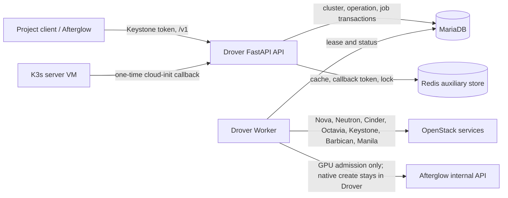

# Drover Architecture

## Overview

Drover는 OpenStack 프로젝트 단위로 K3s 클러스터와 노드그룹의 생성·운영·삭제를 담당하는 독립적인 control plane 서비스다. Afterglow가 화면과 외부 BFF를 소유한다면 Drover는 `/v1` API, 내구성 작업 큐, OpenStack 자원 inventory, VM callback 이후의 K3s 조정을 소유한다.

- Repository: https://github.com/openstack-afterglow/drover
- 분석 기준: `dev` 브랜치, 작업 트리의 소스와 테스트
- 패키지: candidate `drover==0.4.7`은 발행·배포한 `v0.4.6` (`c130d8a`)의 trust 수명, event ID, reconciliation, deleted Operation 복구 및 proxy scheme 조치 위에 `reauthorize` Operation 허용 목록 누락을 수정한다. API·DB schema가 이미 지원한 kind를 service validation에도 허용하며 topology·권한 ceiling·credential rollout 계약은 바꾸지 않는다. `drover-sdk==0.2.21`은 별도 버전으로 유지한다.
- 주요 런타임: Python `>=3.11`(root package `requires-python`; SDK는 `>=3.12`; CI·container image는 3.12), FastAPI `0.141.1`, Starlette `>=1.3.1`(lock `1.6.0`), Uvicorn `0.39.0`, openstacksdk `3.3.0`, SQLAlchemy `>=2.0`, Redis client `5.0.0`

1분 요약: FastAPI API가 MariaDB에 cluster/operation/job을 함께 기록하고, 독립 Worker가 lease를 얻어 OpenStack 작업을 실행한다. 서버 VM의 일회성 cloud-init callback은 K3s bootstrap 결과를 전달하고, Worker가 agent/HA 후속 작업을 수행한다. MariaDB는 내구성 상태와 queue의 정본이며 Redis는 callback token·짧은 상태/헬스 캐시·분산 잠금·stampede 이벤트 같은 보조 저장소다.

## Development status

| 기능 | Implementation | Verification evidence | Current limit | Source |
|---|---|---|---|---|
| Native `/v1` API와 Keystone 프로젝트 격리 | implemented | source-reviewed, test-defined | Magnum wire 호환 API가 아니다 | `drover/main.py:127-143`, `drover/auth.py`, `tests/test_auth.py`, `tests/test_openapi_contract.py` |
| 내구성 cluster create와 operation ID | implemented | source-reviewed, test-defined | 외부 operation ID/idempotency 계약은 create API에만 있다 | `drover/api/clusters.py:create_k3s_cluster_async`, `drover/services/jobs.py:enqueue_job`, `tests/test_durable_create.py` |
| lease worker와 retry/attempt fence | implemented | source-reviewed, test-defined | 최대 3회 시도 후 실패하며 원격 API의 모든 작업을 되돌린다고 보장하지 않는다 | `drover/services/jobs.py:_claim_one`, `process_one_job`, `tests/test_jobs.py` |
| cloud-init callback 및 HA/agent handoff | implemented | source-reviewed, test-defined | callback 만료/실패는 cluster를 `ERROR`로 만들며 callback token은 Redis 일회성이다 | `drover/api/callback.py:k3s_callback`, `drover/services/provisioner.py`, `tests/test_k3s_callback.py` |
| nodegroup·Stampede autoscale | implemented | source-reviewed, test-defined | min_size/max_size, 300–600초 안정화 윈도우, Pod requests/Node allocatable 정밀 계산, GPU allocatable 확인, 안전 drain/relocation 경계 안에서 동작한다 | `drover/services/autoscale.py`, `drover/services/stampede.py`, `drover/services/gpu.py`, `drover/services/kube.py`, `tests/test_k3s_stampede.py` |
| OpenStack drift reconciliation | implemented | source-reviewed, test-defined | orphan은 보고만 하고 자동 삭제하지 않는다 | `drover/services/reconciliation.py:reconcile_cluster`, `tests/test_reconciliation.py` |
| Requester trust / cluster resource authority / GPU admission | implemented | local suite, native loopback SDK, MariaDB 11.4 ledger (2026-10-07) | live-verified 아님; legacy cluster는 재인가 필요; trust DELETE 장애는 sweep 재시도, 인증 거부는 expiry까지 inert 기록 | `drover/services/execution.py`, `delegation.py`, `cluster_authority.py`, `guest_rollout.py`, `afterglow.py`, `autoscale.py`, `tests/test_execution_authority.py`, `tests/test_native_trust_loopback.py` |
| legacy `gpu_quotas` 제거 | partial | source-reviewed, test-defined | 역사적 `001_baseline.sql` 테이블은 아직 물리 삭제하지 않았고 조건부 runbook만 있다 | `drover/migrations/001_baseline.sql`, `drover/migrations/README.md`, `docs/gpu-quota-table-retirement-runbook.md` |

위 표의 `test-defined`는 테스트가 계약을 정의한다는 뜻이다. 2026-10-06 최종 0.4.3 hardening 소스에서 `uv run --frozen pytest tests`는 866건 통과·3건 skip이었고, `uv --directory sdk run --frozen pytest`는 111건 통과했다. skip된 live integration은 이 수치에 포함되지 않는다. 별도로 관측한 OpenStack/K3s CPU·GPU scaling, 삭제 안전 경로, 실제 tagged Kolla 배포와 외부 endpoint 결과 및 한계는 [`0.4.3 검증 기록`](docs/release-0.4.0.md#tagged-043-verification-2026-10-06)에서 구분한다.

현재 execution-authority cutover의 2026-10-07 로컬 증거: `uv run --frozen --extra service --extra dev pytest -q tests --ignore=tests/integration`는 1123건 통과·1건 skip, SDK `tests/test_proxy.py`는 114건 통과했다. `tests/test_native_trust_loopback.py` 2건은 실제 keystoneauth1/python-keystoneclient/openstacksdk가 synthetic loopback Keystone HTTP에 caller-token trust create, project selector 없는 OS-TRUST 인증·token 검증(implied `reader` 허용), impersonating trust-token DELETE, revoked-role terminal failure를 요청했다. disposable MariaDB 11.4에서 ledger 001–004가 적용되고 004 statement 재실행이 no-op였으며 두 번째 `migrate --apply`는 pending이 없었다. 이는 실제 Keystone 정책·OpenStack/K3s·Barbican/Octavia guest rollout 검증이 아니며 아래 역사적 릴리스/배포 결과도 새 모델의 live evidence가 아니다.

## System context


```mermaid
graph LR
    User[Project client / Afterglow] -->|Keystone token, /v1| API[Drover FastAPI API]
    API -->|cluster, operation, job transactions| DB[(MariaDB)]
    API -->|cache, callback token, lock| Redis[(Redis auxiliary store)]
    Worker[Drover Worker] -->|lease and status| DB
    Worker -->|Nova, Neutron, Cinder, Octavia, Keystone, Barbican, Manila| OS[OpenStack services]
    VM[K3s server VM] -->|one-time cloud-init callback| API
    Worker -->|GPU admission only; native create stays in Drover| AG[Afterglow internal API]
```

호출자는 Keystone 토큰으로 `/v1`에 요청한다. API는 프로젝트와 현재 정책을 확인하고 requester trust를 job/operation과 연결한다. Worker는 그 trust 또는 재인가된 cluster control credential만 사용한다. VM callback 후속 작업도 원래 create trust를 이어 쓴다. Afterglow는 UI/BFF와 선택적 GPU admission 경계이며 provisioning intent로 VM 생성을 위임하지 않는다.

## Code map

| 경로·심볼 | 책임 | 의존 방향 |
|---|---|---|
| `drover/main.py:app`, `readiness_checks` | FastAPI lifecycle, `/v1` router mount, liveness/readiness | API → DB/Redis/Keystone |
| `drover/middleware.py:CorrelationMiddleware`, `safe_metadata`, `drover/logging.py:configure_logging` | HTTP 완료 로그, 값 없는 제한적 DEBUG 요약, API/Worker 공통 `LOG_LEVEL` | API/Worker → 표준 logging; credential payload 제외 |
| `drover/api/clusters.py:create_k3s_cluster_async` | policy snapshot, cluster row, durable create job, SSE event replay | API → `services.store`, `services.jobs`, `services.operations` |
| `drover/api/callback.py:k3s_callback` | CIDR 검사, one-time token 소비, callback 상태 기록, HA/agent job enqueue | VM → API → DB/Redis |
| `drover/services/jobs.py` | MariaDB queue enqueue/claim, 15분 lease, heartbeat, retry/complete | Worker → provisioner/autoscale/deletion/reconciliation |
| `drover/services/operations.py` | operation 상태·순서 이벤트·idempotency hash·callback timeout | API/Worker → ORM |
| `drover/services/provisioner.py:create_cluster_job`, `bootstrap_ha_servers`, `provision_agents` | Nova/Cinder/Neutron/Octavia 자원과 K3s userdata 생성 | Worker → OpenStack adapters/cloud-init |
| `drover/services/autoscale.py`, `drover/services/stampede.py` | nodegroup 조정, pod 관찰 기반 Stampede scale-up/down | Worker → jobs, K8s API, optional Afterglow |
| `drover/services/reconciliation.py:reconcile_cluster` | recorded inventory와 실제 OpenStack ID/state 비교, drift 기록 | Worker → inventory/Keystone/OpenStack |
| `drover/services/afterglow.py` | GPU admission HTTP boundary만 제공; provisioning intents 제거 | Stampede planner/native GPU worker create → Afterglow |
| `drover/services/execution.py`, `delegation.py` | job별 단일 authority binding, requester trust admission/revalidation/release/sweep | API/Worker/callback → Keystone |
| `drover/services/cluster_authority.py`, `guest_rollout.py`, `drover/api/authorization.py` | control/guest credential 세대, 재인가 rollout/activation/retirement | API/Worker → Keystone/Kubernetes |
| `drover/models/orm.py` | `K3sCluster`, `DroverJob`, `DroverOperation`, event, inventory의 DB schema | SQLAlchemy → MariaDB |
| `drover/migrations/manifest.txt`, `drover/migrations/*.sql` | immutable baseline와 migration ledger | `drover-migrate` → MariaDB |
| `drover/worker.py:_main_async` | reconcile/jobs/health/Stampede loop를 한 Worker process에서 실행 | Worker → services |
| `sdk/drover_sdk/service.py:DroverService` | openstacksdk에 `drover` catalog service와 `container-infra` alias 등록 | SDK → `Proxy` |
| `sdk/drover_sdk/proxy.py:Proxy` | `/v1` REST/SSE 호출, shell ticket 발급 및 operation polling helper | SDK client → Drover API |

## Runtime flows

### Cluster create → callback → ACTIVE

1. `POST /v1/clusters/async`가 request hash와 선택적 `(project_id, Idempotency-Key)`를 확인한다. 정책·템플릿을 resolve하고 cluster를 기록한 뒤 caller token으로 operation trust와 generation 1의 restricted control/필요한 guest credentials를 만든다. credential generation과 trust/operation/create job을 durable transaction으로 연결한다. 미커밋 credential/trust는 caller token으로 회수 시도한다.
2. SSE는 DB의 `DroverOperationEvent`를 순서대로 replay하며 operation ID를 모든 progress event에 싣는다. 연결이 끊겨도 job은 취소되지 않는다.
3. Worker는 같은 cluster에 활성 lease가 없을 때 job을 claim하고, 현재 requester 권한 및 trust token을 검증한 operation connection으로 Security Group, HA Octavia LB/FIP, Cinder boot volume, callback token, Nova server와 inventory를 만든다.
4. `/v1/callback`은 CIDR·Redis one-time token 검증 후 kubeconfig를 암호화해 저장한다. `provision_agents`, `bootstrap_ha` 및 HA callback의 Octavia 조회/변경은 create operation의 active delegation을 재사용한다. callback은 새 authority를 부여하지 않으며 trust가 없거나 revoked/만료되면 service/creator fallback 없이 실패한다.
   HA callback의 LB-member update 예외는 현재 warning으로 기록하고 join-count/후속 enqueue를 계속할 수 있다. 이 경로가 callback HTTP/operation을 즉시 terminalize한다고 주장하지 않는다. connection은 다른 identity로 대체하지 않으며 delegation 없는 후속 mutation job은 worker에서 terminal failure다.
5. agent job이 완료되면 cluster가 `ACTIVE`가 되고 create operation이 `SUCCEEDED`가 된다. callback 실패·누락·30분 timeout은 operation/cluster를 실패 처리한다.

선택한 `key_name`은 API admission에서 요청자 connection으로 공개키를 조회·검증한 뒤 기존 cluster/job `ssh_public_key`에 snapshot으로 저장한다. Worker는 requester trust로 실행하며 Nova에 키페어 이름을 전달하지 않고 primary·HA server·agent의 Ubuntu cloud-init/FCOS Ignition에 공개키를 설치한다. named-key 구 job/cluster에 snapshot이 없으면 fail closed 한다. caller token/private key는 저장하지 않으며 별도 manager 키페어는 만들지 않는다.

신규 클러스터의 기본 NIC는 외부 Neutron provider 네트워크에 직접 연결한다. `drover/api/clusters.py`는 명시적 `network_id`를 `k3s.default_network` 정책과 같은 external-only 검증으로 제한하고 내부망이면 자원·cluster·job 생성 전에 400을 반환한다. 값 생략/빈 값은 저장된 외부망 기본 정책을 사용하며 정책 누락·stale·조회 장애는 503으로 거부한다. 선택한 ID/name은 기존 cluster/job `network_id`와 `resource_policy_snapshot`에 저장되어 primary·HA·agent·nodegroup 경로에서 같은 네트워크를 사용한다. 네트워크 snapshot이 없는 구 create job도 Nova 자동 선택으로 진행하지 않는다. 기존 내부망 클러스터를 자동 이관하지 않으며 DB schema는 바뀌지 않는다.

`cloudinit.py:_build_k3s_network_pin_script`는 생성 네트워크 ID→metadata link→MAC→guest NIC로 `node-ip`, `flannel-iface`, server `advertise-address`를 고정하고 재실행 시 저장된 pin을 보존한다. 추가 내부 NIC는 연결 서브넷 접근에만 사용하며 Ubuntu netplan은 DHCP route/DNS와 IPv6 RA를 거부하고 FCOS NetworkManager는 `never-default`, `ignore-auto-routes`, `ignore-auto-dns`, IPv6 disabled를 적용한다. K3s 내부 Pod 경로는 아래 main-table 예외를 유지한다. 상세 계약은 [`docs/drover-feature-coverage.md`](docs/drover-feature-coverage.md)의 Neutron 절을 따른다.

Ubuntu·FCOS의 udev NIC add rule은 모든 rule 처리 후 평가되는 `RUN`의 `$name`으로 최종 NIC 이름을 전달하고 `systemctl --no-block`으로 별도 systemd handler를 요청한다. 커널 이벤트 이름 `%k`는 hotplug 시 `eth0`일 수 있어 실제 `ens8`용 설정을 만들지 못한다. `SYSTEMD_WANTS` 대안은 실제 Ubuntu hotplug 후 속성과 activation이 남지 않아 사용하지 않는다. 최종 RUN 경로는 운영 진단 guest의 실제 detach/attach와 재부팅에서 provider-only default route, 보조 NIC DHCP 주소·빈 DNS·IPv6 RA 차단 및 K3s Ready를 확인했다.

모든 primary·HA server와 agent userdata(Ubuntu cloud-init, FCOS Ignition)는 `drover/services/cloudinit.py:_k3s_pod_route_files`가 만든 script(`/usr/local/sbin/afterglow-k3s-pod-route.sh`), watcher unit(`afterglow-k3s-pod-route.service`), K3s unit drop-in(`k3s.service.d` 또는 `k3s-agent.service.d/10-afterglow-pod-route.conf`)을 설치한다. image-builder `pbrutil`의 source-address rule(priority 30000)이 가리키는 NIC별 table에는 CNI route가 없어 node 주소에서 Pod(`10.42.0.0/16`)로 가는 응답이 NIC gateway로 빠질 수 있다. drop-in은 K3s가 시작될 때마다 `ExecStartPre`로 priority 29999 `to 10.42.0.0/16 table main` rule을 보장하고 실패 시 시작하지 않는다. Ubuntu는 해당 rule에 `protocol kernel`을 지정해 systemd-networkd의 foreign-rule 수거 대상에서만 제외한다. Ubuntu guest에서 watcher를 멈추고 기존 unmarked rule이 provider NIC `networkctl reconfigure` 뒤 3초 내 삭제되는 반면 동일 rule에 `protocol kernel`을 붙이면 잔존하는 것을 확인했다. 전체 foreign-rule 관리 정책은 바꾸지 않는다. FCOS는 pin된 provider NIC의 활성 NetworkManager connection에 같은 rule을 `ipv4.routing-rules`(main table ID 254)로 저장하고 `nmcli device reapply`로 적용하며, ownership 저장 실패 시 K3s 시작을 거부한다. watcher는 일시적 손실 시 5초 주기로 복구한다. provider NIC pin과 보조 NIC의 default route/DNS 제한은 그대로다. Drover는 `--cluster-cidr`를 바꾸지 않으므로 K3s 기본 Pod CIDR만 대상으로 한다. `tests/test_k3s_pod_route.py`는 네 node 유형의 설치와 manager 소유권·ensure 멱등·fail-closed 계약을 정의한다. 2026-09-26 DMSLab에서 새 userdata로 만든 Ubuntu 2-node provider 클러스터는 watcher를 멈춘 `netplan apply` 중 rule 누락 0회였고, 보조 NIC 연결 뒤와 재부팅 뒤 Pod→API TLS·node 간 Pod HTTP·OCCM Octavia LoadBalancer HTTP를 통과했다(live-verified, [`docs/release-0.2.24.md`](docs/release-0.2.24.md)). 이 배포에는 `k3s.fcos_image` 정책이 없어 FCOS 실 guest 재구성은 검증하지 않았고, NetworkManager 1.42 source의 rule 직렬화가 script 비교 문자열과 같다는 것만 확인했다. [systemd networkd.conf](https://www.freedesktop.org/software/systemd/man/latest/networkd.conf.html#ManageForeignRoutingPolicyRules=), [ip-rule protocol](https://man7.org/linux/man-pages/man8/ip-rule.8.html), [NetworkManager routing-rules](https://networkmanager.pages.freedesktop.org/NetworkManager/NetworkManager/nm-settings-nmcli.html).

게스트 플러그인의 인증 URL은 `provisioner.py:_guest_plugin_settings`가 admitted operation connection의 region별 `identity` public catalog endpoint로 선택한다. backend internal 인증 설정은 보존하고 guest-only Settings copy와 resource snapshot을 사용한다. 활성 플러그인이 없으면 조회하지 않으며 public endpoint 누락·잘못된 URL은 자원 생성 전에 거부한다. OCCM은 `--disable=servicelb`와 agent external cloud-provider 인자를 적용한다. provider/public network가 같으면 OCCM public 분류를 생략해 provider 주소를 `InternalIP`로 유지한다.

OCCM은 표시 이름이 아니라 불변 cluster ID를 `--cluster-name`으로 받는다. 따라서 Service LB 이름은 `kube_service_<cluster_id>_<namespace>_<service>`, 설명은 `Kubernetes external service <namespace>/<service> from cluster <cluster_id>`가 된다. 이 LB는 Drover inventory에 기록되지 않으므로 `deletion.py`는 모든 VM 삭제 후 `octavia.delete_occm_service_load_balancers`로 이 prefix와 설명이 모두 일치하는 LB만 cascade 삭제한다. VM이 없으므로 OCCM이 다시 만들 수 없고, 대기 중인 LB는 Octavia가 ACTIVE/ERROR로 정리할 때까지 기다린다. 같은 VIP port의 floating IP는 OCCM 생성 설명과 일치하고 OCCM도 그 LB와 함께 삭제했을 경우에만 먼저 삭제한다. OCCM은 Service에 `loadbalancer.openstack.org/keep-floatingip: "true"`가 있으면 FIP를 남기고 이 의사는 Kubernetes에만 있으므로, `deletion.py`는 노드·VM을 건드리기 전에 이 cluster의 OCCM LB가 있으면 admin kubeconfig로 모든 namespace의 Service annotation을 읽는다(`kube.list_service_annotations`). LB를 쓰는 Service(이름이 가리키는 생성자, `load-balancer-id` annotation의 공유자) 중 하나라도 keep을 요청하면 FIP를 남긴다. Kubernetes를 읽지 못했거나 LB의 Service가 스냅샷에 없으면 의사를 알 수 없으므로 역시 남기며, LB 삭제는 연결만 해제한다. 사용자가 지정한 FIP와 다른 cluster의 LB는 건드리지 않는다. 한 LB의 실패는 나머지 정리를 막지 않으며 기존 삭제 단계처럼 경고로 남는다. octavia-ingress-controller의 LB는 이 cleanup 범위가 아니다.

HA joiner(server 2·3)는 `cloud_conf=None`으로 OCCM/CSI manifest용 cloud.conf를 재렌더링하지 않고 server 1의 `kube-system/cloud-config` Secret을 공유한다. 별도로 Barbican KMS가 활성화되면 암호화 저장된 active guest credential을 읽어 각 joiner의 host KMS 파일을 렌더링하고, admitted operation connection으로 project KEK를 조회/생성한다. Drover는 이제 control/guest application credential secret을 암호화해 저장한다. 이 동작은 source-reviewed이며 live HA 검증이 아니다.

### Reconnection, idempotency, scale/delete

- create에 같은 idempotency key와 같은 canonical request hash를 재전송하면 기존 operation/cluster를 재사용하고, hash가 다르면 `409`다. 이 계약은 `POST /v1/clusters/async`에 한정된다.
- SSE 재연결은 `GET /v1/operations/{operation_id}`와 `GET /v1/operations/{operation_id}/events?since_sequence=N`으로 DB event sequence를 replay한다. SDK `Proxy`는 operation 상태를 조회할 수 있지만 서버 작업을 HTTP 연결 수명에 묶지 않는다.
- `PATCH /v1/clusters/{cluster_id}/scale`, nodegroup 조정 및 일반 delete는 durable job으로 enqueue된다. 현재 이 경로에는 create와 같은 외부 idempotency key 재사용/operation ID 응답 계약이 없다. 호출자는 자동 재시도 대신 correlation ID와 cluster 상태를 확인해야 한다.
- 예외: 현재 tenant `POST /v1/clusters/{id}/delete-async`는 `_delete_cluster_progress`에 caller connection을 직접 전달하는 SSE 경로다. durable job/trust admission 또는 disconnect 이후 계속 실행되는 계약이 없으며 caller 소유 credential도 이 connection으로 회수한다. durable tenant DELETE와 admin delete의 operation-trust 경로와 구분한다.

### Execution authority와 재인가 (로컬 suite·native loopback 검증; live-verified 아님)

- **Operation trust**: create/scale/delete 및 mutation nodegroup/admin 경로는 타깃 project-scoped caller token으로 trust를 admit한다. trustor=requester, trustee=자기 service project에서 resolve한 Drover user, `impersonation=True`. required roles는 모두 현재 보유해야 하고 optional roles는 보유한 것만 위임한다. `admin`/`manager` 위임은 금지한다. service identity를 tenant project로 scope하거나 다른 identity로 fallback하지 않는다.
- **검증과 오류**: trust record의 ID/trustor/trustee/project/impersonation/role subset/expiry를 확인한다. 각 connection에서 enabled user/project, 현재 held role IDs, 해당 create/scale/delete capability와 trustee를 재검증한다. trust/app-credential token에는 admitted role IDs가 모두 있어야 하며 Keystone이 확장한 implied roles는 허용하되 `admin`/`manager` token roles는 거부한다. token scope/user/credential 또는 trust ID/expiry도 검증한다. scope mismatch, revoked/missing/too-near-expiry authority는 `ExecutionAuthorityError`로 terminal이며 retry하지 않는다. directory/Keystone 통신 장애는 `ExecutionAuthorityUnavailable`로 attempt-fenced retry를 따른다. create rollback delete는 같은 create operation ID에 한정한다.
- **Release/DELETE/sweep**: queued/running job 또는 `QUEUED|RUNNING|WAITING_CALLBACK` operation이 있으면 trust를 유지한다. idle이면 local `released`로 전환하고 `jobs.process_one_job` 종료 후 `delegation.delete_released`가 released/revoked trust를 자신의 impersonating trust-scoped token으로 DELETE한다. `v3.Password(user_id=trustee, trust_id=..., password=...)`에는 project selector가 없고 service identity는 tenant로 scope하지 않는다. 삭제 성공/404는 `deleted`, Unauthorized/Forbidden은 released/revoked를 유지하며 `state_reason="trust inert until expiry"`를 기록한다. 통신 장애는 300초 sweep에서 재시도한다. sweep도 idle release와 trust DELETE를 수행하고 expiry 이후 Keystone GET 404를 확인하면 `expired`로 기록한다. finite TTL은 DELETE 불가/장애 시 수명 상한이며 정상 완료 trust를 expiry까지 방치하지 않는다. caller token은 persist하지 않고 미커밋 admission DELETE에만 일시적으로 사용한다.
- **Keystone 제한**: [master `api/trusts.py`](https://github.com/openstack/keystone/blob/master/keystone/api/trusts.py)의 `_check_delegated_token`은 app-credential/OAuth/EC2 token의 trust 관리(DELETE 포함)를 막는다(명시적 insecure app-credential opt-in 예외). ordinary trust-scoped token은 차단하지 않는다. `identity:delete_trust`의 admin/trustor policy에서 impersonating token의 user는 trustor이므로 Drover는 trust 자체의 token으로 DELETE한다. [master `api/users.py`](https://github.com/openstack/keystone/blob/master/keystone/api/users.py)의 `_block_delegated_token_app_creds`는 trust/OAuth/EC2 token의 app-credential create/read/list/delete를 막고 `_check_unrestricted_application_credential`은 restricted app-credential token의 추가 credential 관리를 막는다. 따라서 app credential 원격 회수는 owner의 non-delegated token이 필요하며 secret erasure/backlog만으로 원격 폐기를 주장하지 않는다. upstream source 검토이지 배포 Keystone 검증이 아니다.
- **Resource authority**: caller token으로 `unrestricted=False`, held delegated-role subset의 user-owned `control`과 플러그인용 별도 `guest` credential을 만든다. secret은 전용 `cluster_app_credential` AES-GCM domain으로 암호화 저장하며 control은 guest에 렌더링하지 않는다. Stampede planner/job은 owner의 현재 `drover:clusters:scale`, reconcile/health는 `drover:clusters:get`과 token owner/project/credential ID/role 검증을 매 connection에 수행한다. active control 없는 legacy cluster는 재인가 필요이고 Stampede enable은 409다. reconcile periodic scan은 authorized cluster만 대상으로 하고 explicit reconcile은 `reauthorization_required`를 반환한다. reconcile job의 authority failure나 credential missing drift 자체는 cluster를 ERROR로 만들지 않아 ACTIVE-only 재인가를 막지 않는다. health Nova floating-IP lookup 실패는 private IP를 유지하며 다른 identity를 쓰지 않는다.
- **Credential issuance role closure**: `auth.current_project_role_state`는 기존 current-project map의 catalog/assignment/실제 inference graph 검증을 공유한다. `cluster_authority.issue`는 configured delegated roots의 current global-ID closure만 허용하고 unsafe (`admin`/`manager`), unknown/domain/ambiguous/unheld role을 거부한다. `_verify_issued`는 반환 roles에 roots가 모두 있으며 closure를 벗어나지 않음을 확인하고 accepted full IDs/names를 snapshot한다. 별도로 보유한 caller 역할은 허용 기준이 아니다. [Keystone stable/2025.2 `_get_roles`](https://github.com/openstack/keystone/blob/stable/2025.2/keystone/api/users.py)는 create 응답에도 implied roles를 넣으므로 이전 roots-only subset 검사는 정상 응답을 거부했다. `tests/test_native_app_credentials.py`는 installed SDK/실제 synthetic HTTP로 expansion 성공과 잘못된 응답의 cleanup을 정의한다(`test-defined`).
- **재인가와 rollout**: `GET/POST /v1/clusters/{id}/authorization`, `POST .../authorization/retire`를 제공한다. POST는 `ACTIVE` cluster에서 다른 mutation이 없을 때 caller-owned credentials를 staged generation으로 저장하고 202와 job/operation ID를 반환한다. worker는 현재 reauthorize capability와 staged token을 확인한다. guest가 있으면 `cloud-config`, `manila-cloud-secret` Secret과 Octavia Ingress `octavia-ingress-controller-config` ConfigMap의 credential keys만 교체한다. 참조하는 `kube-system` Deployment/DaemonSet/StatefulSet을 generation annotation으로 restart하고 rollout 완료를 기다린다. KMS required 또는 legacy detect 모드에서는 각 control-plane host에 privileged hostPID Job을 실행해 Secret 환경변수와 `nsenter`로 `/etc/kubernetes/cloud.conf`(있으면), `/etc/kubernetes/barbican-cloud.conf`를 rewrite하고 `barbican-kms.service` restart/active/socket을 확인한다. 마지막 Secret-write probe까지 성공해야 atomic activation한다.
- **재인가 Operation admission**: `operations.VALID_OP_KINDS`는 migration 004와 reauthorize API/worker가 쓰는 `reauthorize`를 허용한다. 누락 시 credential 발급 뒤 durable enqueue에서 `ValueError`와 HTTP 500이 발생하고 신규 credential을 owner token으로 회수했다. `tests/test_operations_jobs.py:test_enqueue_job_links_operation_transactionally`는 scale/reauthorize의 operation/job/event 원자적 연결을 정의한다.
- **Activation/retirement**: 성공 시 staged를 active로, 이전 active/다른 staged를 retiring으로 바꾸고 이전 secret을 지운다. rollout 부분 실패는 staged `last_error`를 기록하고 이전 active generation은 유지한다; 이미 바뀐 guest 객체를 자동 원복한다고 보장하지 않는다. retiring credential의 원격 폐기는 owner token이 필요하다. owner retire endpoint는 caller 소유 retiring 항목만 삭제하며 legacy owner 없는 항목은 operator out-of-band 회수가 필요하다. 상태 응답에는 reference/state/backlog만 있고 secret은 없다.
- **삭제**: creator가 떠났어도 현재 delete 권한 actor의 새 operation trust로 자원을 삭제한다. tenant admission에서 caller 소유 credential을 caller token으로 동기 회수 시도한다. 삭제 완료 시 남은 모든 secret을 지우고 다른 owner/legacy credential은 `owner_revocation_required`로 보고한다; cluster 삭제가 모든 원격 credential 회수를 보장하지 않는다.

설정은 `[drover]`의 `operation_trust_ttl_seconds=14400`(900–86400), `operation_trust_min_remaining_seconds=300`(60–3600, TTL보다 작음), `delegated_required_roles=["member"]`(비어 있으면 거부), `delegated_optional_roles=["load-balancer_member"]`, `guest_rollout_timeout_seconds=600`(60–3600)이다. Settings/environment/Kolla 변수는 각 이름에 `drover_`/`DROVER_` prefix를 사용한다. Barbican 기본 member 권한과 Octavia `load-balancer_member`의 실제 배포 policy 충족은 **[INFERENCE]**이며 source default만으로 cloud 검증을 주장하지 않는다.

`drover/config.py:get_settings`의 TOML→environment bridge는 list/dict를 표준 JSON으로 직렬화하고 scalar는 string 변환을 유지한다. 환경 키가 존재하면 빈 값도 TOML로 덮어쓰지 않는다. 명시적인 빈 역할 환경값은 Settings JSON validation에서 거부되며 TOML의 member 기본값으로 조용히 대체되지 않는다. 실제 임시 TOML 배열, JSON override 및 empty-key precedence를 native config regressions로 검증한다. configured delegated roots, encrypted stores와 credential/guest lifecycle의 권한 ceiling은 변경하지 않는다.


### Nodegroups, Stampede, reconciliation

`drover/services/autoscale.py`는 desired nodegroup count를 durable `nodegroup_reconcile` job으로 맞추고, `drover/services/stampede.py`는 Kubernetes Pod requests(CPU millicores, memory bytes, NVIDIA GPU slots, extended resources)와 노드 allocatable 용량을 정밀 계산해 명시적 flavor 기반으로 워커 증설을 결정한다.

- **증설 조건 및 GPU 준비성**: PVC 바인딩 지연, 고정 노드 지정, unsupported affinity/topology spread/host port 등 비용량적 pending은 증설하지 않는다. 명시적 nodegroup flavor/label/taint/min-max를 사용한다. nodegroup flavor는 전역 `k3s.default_agent_flavor` 정책(public만 허용)이 아니라 요청 project scope의 Nova 조회로 검증하므로 공유된 private GPU flavor도 허용하고 image는 `k3s.server_image` 정책을 따른다(`resource_policies.py:validate_nodegroup_resource`; nodegroup 생성·수정과 Stampede enable). 모든 GPU 이미지에는 호환 NVIDIA 커널 드라이버가 필요하며 Ubuntu는 toolkit을 설치하고 FCOS는 toolkit/runtime도 사전 포함해야 한다(`drover/services/gpu.py`). join 전 검사는 `nvidia-smi -L`, `nvidia-container-runtime` 존재, `nvidia-container-cli info`다. `nvidia-container-runtime --version`은 runc/crun이 PATH에 없으면 실패하는데 K3s는 시작 전에 이를 제공하지 않으므로 사용하지 않는다. Stampede job은 K3s Ready와 필요한 `nvidia.com/gpu` allocatable을 관측해야 성공한다. admission URL 설정 시 planner는 CPU flavor도 Afterglow 판정을 기다리고 `autoscale.provision_nodegroup_vms`는 기존 VM 복구가 아닌 **각 새 native GPU worker create 전에** `afterglow.require_gpu_admission`을 다시 호출한다. 이 live-count 판정은 capacity reservation이 아니며 denial/unavailability는 fail closed 한다. URL 미설정 환경은 native Nova quota를 따른다. Afterglow provisioning intent 경로와 설정은 제거됐다.
- **원자적 예약 및 Fencing**: 수동 nodegroup 변경 및 Stampede sizing 결정은 MariaDB transaction 내 row lock(`with_for_update`)과 job enqueue를 원자적으로 수행한다. `in_flight_count`와 active mutation job으로 중복 증설을 차단하고 `_settle_stampede_job`은 정리 완료한 DB tracking rows 기준으로 count/state를 동기화한다. 부분 정리 실패 row는 삭제하지 않고 재시도를 위해 보존한다.
- **안전한 축소 및 Drain**: 300–600초 연속 저사용량 뒤 한 번에 worker 하나를 선정한다. 삭제 직전 모든 tracked VM을 Nova ID 조회(`nova.py:observe_server`, `compute.get_server`)로 다시 관측해 absent/deleting VM을 min-size headroom에서 제외하고, live pending/Ready와 controller, PVC/local storage, selector/taint, 잔여 용량을 검사한다. 실제 404만 absent이며 403/400 등은 그대로 실패한다(SDK `find_server`는 GET 403/400 뒤 이름 검색으로 fallback하므로 사용하지 않는다). cordon은 같은 merge-patch로 Node annotation `drover.io/removing-vm-id=<vm_id>`를 남긴다. 실제 Eviction API로 PDB를 준수하며 Pod가 사라져야 drain이 성공한다. drain 실패와 DELETE 직전 최종 Nova 조회·소유권 재검증 실패는 이번 시도가 새로 얻은 cordon만 uncordon(annotation 제거)하며 실패 노드명도 오류에 남긴다. 시도 전에 이미 같은 VM annotation으로 cordon된 노드는 이전 DELETE 뒤일 수 있으므로 상속된 cordon으로 보고 되돌리지 않는다. 최종 재검증을 통과한 뒤에는 DELETE 거부·timeout/volume/Node/DB 정리 실패라도 uncordon하지 않는다. 재시도는 같은 VM annotation이 있는 자기 cordon만 `node_not_ready`에서 제외하고 나머지 guard를 다시 적용해 재개하며, 다른 cordon은 계속 차단한다. Nova-confirmed absent/deleting 재시도는 live relocation/Ready 검사를 생략하고 Nova disappearance, boot-volume, K8s Node, tracking row 정리를 재개한다. Nova 소멸 뒤 inventory에 기록된 `<node>-boot` volume이 남아 있으면 ID 조회로 `available`·미부착·소유권 통과일 때만 삭제하고, 부착/busy/외부 소유 volume은 보존한 채 `boot_volume_delete_unverified`로 실패한다(`cinder.py:delete_detached_boot_volume`). 삭제 후 count reconcile은 404 sibling을 live count에서 빼되 tracking row는 자체 정리를 위해 남긴다(`autoscale.py:delete_nodegroup_vms`, `reconcile_nodegroup_vms`, `stampede.py:_delete_and_track`, `kube.py:cordon_node`).
  **Legacy 정리 맥락**: cutover 이전 Afterglow provisioning intent로 생성된 worker는 boot volume에 delete-on-termination이 없을 수 있어 위 detached-volume 정리가 여전히 필요하다. 이는 과거 inventory의 정리 사유이며 현재 provisioning intent 실행 경로는 없다.
- **관측 장애 대응**: 관측 실패 또는 이전 관측과 두 scan interval을 초과한 공백은 유휴 윈도우를 초기화한다. 상태 API는 MariaDB에 저장한 마지막 관측을 반환하며 `ready_count`는 K3s Ready 수일 뿐 GPU 준비성 보장이 아니다. Redis 이벤트는 best-effort이고 DB operation/event가 내구성 정본이다. worker의 별도 drift reconciliation은 기록한 외부 ID의 missing/mismatch/orphan을 확인한다.
- **미등록 worker의 수동 정리**: 성공한 전체 Node 관측에서 이름이 없는 live VM은 `kube.py:cordon_node(create_missing=True)`로 해당 이름의 실제 Node를 `spec.unschedulable=true`와 제거 VM annotation으로 POST 예약한다. 201만 성공으로 인정하며 409·권한 거부·불확실한 응답은 VM 삭제를 중단한다. 예약은 실패 시에도 uncordon하지 않아 늦은 kubelet 등록을 차단하고, 정상 drain·최종 Nova 소유권 재검증·삭제 확인 뒤에만 Node를 정리한다. 자동 축소의 Ready/min-size/재배치 조건은 완화하지 않는다.
- **GPU 실패 사유**: `stampede.py:_provision_and_track`는 Node가 Ready가 되지 않은 실패를 `node_not_ready`, Ready 이후 요청한 GPU allocatable이 부족한 실패만 `gpu_not_allocatable`로 기록한다. 부분 VM 생성은 `provision_failed`가 우선이며, 여러 worker 중 join 실패가 있으면 GPU 부족보다 join 실패를 우선한다.

Keystone credential reconciliation은 active generation reference만 대상으로 하며 control connection의 `current_user_id`와 credential ID를 user-scoped SDK GET에 전달한다. historic manager-owned inventory 항목은 건너뛰고 retiring backlog로 다룬다. 실제 404만 missing이고 인증·통신 오류는 missing으로 숨기지 않는다. credential missing은 non-required drift이므로 그 자체로 cluster를 ERROR로 바꾸지 않으며, reconcile job의 terminal authority failure도 기존 cluster 상태를 보존해 ACTIVE-only 재인가를 허용한다. schema는 `004_execution_authority.sql`로 확장되었다.

### Certificate rotation

`POST /v1/clusters/{cluster_id}/rotate-certs`(`drover/api/certificates.py`)는 `master_count>=3`인 `ACTIVE`/`ERROR` cluster에서만 Redis rotation lock을 얻고 `drover/services/cert_rotation.py:rotate_certificates` SSE를 연다. control-plane 노드마다 `kube-system` Job(`nsenter -t 1 ... systemctl restart k3s`)을 만들고, Job 성공(최대 120초)을 확인한 뒤 `wait_node_ready`(기본 `drover_cert_rotation_node_timeout_sec=300`)가 Ready=True를 처음 관측하면 바로 다음 노드로 넘어간다. 대기 중에는 10초(`_NODE_READY_KEEPALIVE_SECONDS`)마다 SSE keepalive를 보낸다.

- 노드 사이에 고정 settle 대기는 없다. 안전 간격은 `systemctl restart k3s`가 k3s READY까지 블록한다는 데 기댄다. 서버 설치 경로는 모두 `INSTALL_K3S_TYPE` 없이 `curl -sfL https://get.k3s.io | ... sh -s - server`를 실행한다(`drover/templates/k3s_server.yaml.j2`의 서버 설치 단계 — Barbican KMS 경로도 KMS sock 준비 뒤 같은 단계를 쓴다 — 와 FCOS `drover/services/cloudinit.py`). upstream `install.sh`는 이때 unit을 `Type=notify`로 쓰고, upstream k3s server는 embedded etcd와 apiserver가 ready가 된 뒤 `READY=1`을 보내므로 restart는 그때까지 블록한다. 이 근거는 upstream master 소스이며 고정한 `k3s_version`이나 이 저장소 테스트로 확인하지 않았다.
- 남은 위험: `wait_node_ready`의 첫 poll은 Job 완료 직후라 node-monitor-grace-period 동안 stale Ready=True를 볼 수 있고, restart 사이에 etcd member health는 확인하지 않는다. control-plane restart 사이 최소 간격이 필요하면 이름 있는 settle 상수(테스트는 0으로 patch)나 Job 완료 이후 Ready `lastHeartbeatTime`·etcd health 확인을 추가한다. 이전 루프의 암묵적 10초 하한(Job 완료 뒤 최소 10초)을 없앤 것은 운영 동작 변경이며 owner 확인을 아직 받지 않았다.
- SSE 소비자가 끊겨 `rotate_certificates` generator가 keepalive yield에서 close(`aclose`)되거나 Ready 대기 중 cancel되면 generator의 `finally`가 Ready polling task를 취소한다. close 경로는 `tests/test_k3s_cert_rotation.py::test_rotate_certificates_cancels_node_ready_wait_when_consumer_disconnects`가 정의하고(test-defined), cancel 경로는 아래 lock 결함과 같은 scratch probe로만 확인했다. 이 보장은 generator 수준이며 endpoint의 lock 해제는 포함하지 않는다.
- admin `GET /v1/admin/clusters/{cluster_id}/certificate-expiry`와 `POST /v1/admin/clusters/{cluster_id}/rotate-certs`(`drover/api/admin.py`)는 각각 TLS probe를 await하고, tenant 경로와 같은 Redis rotation lock을 획득한 뒤 올바른 인자로 `rotate_certificates`를 호출하여 `K3sProgressMessage`를 SSE로 직렬화한다. admin 경로의 lock release도 generator의 `finally`에 있으므로 disconnect 취소 시에는 아래 tenant 경로와 같은 release 위험이 남는다. `tests/test_admin.py`에 해당 경로의 계약이 정의되어 있다(test-defined).
- 알려진 결함(이 변경 전부터 있음, `drover/api/certificates.py`는 이 CI 변경에서 바뀌지 않았다): tenant endpoint에서 SSE 소비자가 Job 완료 대기나 node Ready 대기 중에 끊기면 rotation lock이 해제되지 않는다. uvicorn 0.39는 ASGI `spec_version` 2.3을 보고하므로 Starlette 0.50 `StreamingResponse`는 disconnect 시 anyio task group을 cancel한다. anyio는 cancel된 scope 안의 다음 await에 cancel을 다시 전달하므로 `_gen`의 `finally: await release_rotation_lock(cluster_id)`도 Redis DELETE 전에 cancel되고, `release_rotation_lock`의 `except Exception`은 `CancelledError`(BaseException)를 잡지 않는다. 그러면 lock은 `_REDIS_LOCK_TTL`(900초) 만료까지 남고 그동안 재시도는 `409`다. 2026-09-24 scratch probe(실제 `rotate_cluster_certs`·`release_rotation_lock`, fake Redis, `StreamingResponse`를 `spec_version` 2.3으로 직접 구동)에서 두 대기 중 disconnect 모두 lock이 남고 DELETE가 호출되지 않았으며, disconnect 없이 끝난 대조 실행은 lock을 해제했다. 저장소 테스트는 없다. 수정 후보는 lock 해제를 `anyio.CancelScope(shield=True)`로 감싸고 endpoint 수준 disconnect 테스트를 추가하는 별도 변경이다.

## Data and contracts

### Authoritative storage와 cache split

- **MariaDB가 정본**: `K3sCluster`, `K3sNodegroup`, `K3sAgentVM`, `DroverJob`, `DroverOperation`, `DroverOperationEvent`, `ManagedOpenStackResource`, policy/runtime setting과 암호화된 kubeconfig를 저장한다. queue claim/lease와 operation event도 SQL transaction/row lock으로 보호한다.
- **Redis는 보조 저장소**: callback/HA callback token과 HA join counter의 TTL 일회성 값, health 결과, 짧은 API/cache 응답, shell ticket, rotation lock, Stampede event list를 저장한다. Redis는 cluster/job/operation의 durable authority가 아니다. 일부 legacy DB-unavailable fallback이 있어도 정상 배포의 durable contract는 MariaDB다.
- **OpenStack은 외부 자원 authority**: Nova/Neutron/Cinder/Octavia/Keystone 등 실제 자원 상태는 `ManagedOpenStackResource` ID와 metadata로 추적하며 reconciliation이 DB inventory와 대조한다. Drover DB가 OpenStack 자원을 대체하지 않는다.

### 주요 상태와 불변식

- operation 상태: `QUEUED → RUNNING → WAITING_CALLBACK → SUCCEEDED|FAILED|CANCELLED`; event `sequence`는 operation별 증가한다.
- job 상태: `queued|running|completed|failed`; `_LEASE_SECONDS=900`, heartbeat와 attempt fence로 stale worker를 재실행하며 `_MAX_ATTEMPTS=3`이다.
- cluster 상태에는 `CREATING`, `PROVISIONING`, `ACTIVE`, `SCALING`, `DELETING`, `ERROR`, `DELETED`가 사용된다. project ID와 cluster ID 소유권을 모든 테넌트 조회에서 확인한다.
- callback token은 callback endpoint에서 source CIDR를 검사한 후 단 한 번 소비한다. kubeconfig는 API 응답에 평문으로 저장하지 않고 encryption key로 암호화한다.

### API, SDK, catalog 계약

API namespace는 `/v1`이며 health/discovery도 `/v1` 아래에 있다. Keystone service **name**과 **type**은 모두 `drover`이고, `drover-sdk`가 SDK에서 `drover`를 canonical service로 노출하면서 `container-infra`를 alias로 지원한다. 즉 `container-infra`는 Keystone catalog type이 아니라 SDK 호환 alias다. `drover_sdk.register(conn)` 후 `conn.drover`가 `/v1` endpoint를 사용한다.

`drover/auth.py:validate_token`은 `X-Project-Id`가 없는 SDK 호출에서 제출된 토큰을 Keystone `/v3/auth/tokens`로 검증하여 원래 project/token/roles를 보존한다. Keystone URL은 root와 `/v3` 형식을 모두 지원한다. 무범위 token 재인증은 사용자의 default project로 바뀌거나 unscoped token을 발급하므로 검증 용도로 사용하지 않는다. 명시적인 project header가 있을 때만 기존 Keystone-authorized rescope를 수행하며, 프로젝트 없는 토큰·검증 실패·기존 admin/owner 정책은 fail-closed로 유지한다. 배포 topology와 schema는 변경하지 않는다.

FastAPI `>=0.132`의 기본 strict content-type 검사에 따라 JSON body를 받는 endpoint는 `Content-Type: application/json` 계열 헤더가 없는 요청을 `422`로 거부한다. cloud-init callback 스크립트(`drover/templates/k3s_server.yaml.j2`, `drover/templates/k3s_server_fcos_callback.sh.j2`, `drover/services/cloudinit.py`의 install script)와 `drover-sdk`의 `json=` 요청은 이 헤더를 보낸다. 헤더 없이 JSON을 보내는 외부 호출자는 헤더를 추가해야 한다. Rate limit은 `@limiter.limit` route decorator(`drover/api/callback.py`, `health.py`, `clusters.py`)에서만 적용된다. FastAPI `>=0.137`의 `app.routes`는 include된 router를 tree로 유지하므로 `SlowAPIMiddleware`는 include된 `/v1` route의 handler를 찾지 못하고 요청을 그대로 통과시킨다. 현재 `drover/rate_limit.py:limiter`에는 코드 인자(`default_limits`/`application_limits`)나 slowapi 환경 설정(`RATELIMIT_DEFAULT`/`RATELIMIT_APPLICATION`, 작업 디렉터리 `.env`)으로 주는 전역 limit이 없어 동작은 이전과 같다. 다만 이런 전역 limit을 추가해도 include된 route에는 적용되지 않는다.

`drover/migrations/manifest.txt`와 migration SQL의 checksum ledger가 schema 선행 조건이다. `001_baseline.sql`은 historical `gpu_quotas`를 포함하고 있으며 source table 은퇴는 Afterglow import·sole-authority rollout·query 부재 감사 뒤에만 가능하다. 현재 코드가 그 table을 물리적으로 삭제했다고 주장하지 않는다.

## Deployment and operations

배포 단위는 다음과 같이 분리된다.

- `drover-api` (`drover.main:run`): FastAPI/Uvicorn, 기본 port `8011`, `/v1` REST/SSE/WebSocket와 liveness/readiness.
- `drover-worker` (`drover.worker:main`): jobs lease executor, callback recovery, reconciliation, health, Stampede loop. API process와 독립적으로 실행해야 한다.
- `drover-migrate` (`drover.scripts.migrate:main`): `manifest.txt` checksum ledger를 적용·검사하며 API/Worker보다 schema를 먼저 준비한다.
- `drover-sdk`: `sdk/`의 독립 Python package이며 API/Worker process에 import되어야 하는 내부 module이 아니다.
- `deploy/kolla/`: API, Worker, migrate container와 Keystone catalog registration/config를 Kolla-Ansible 자산으로 제공한다.
- 루트 `drover` wheel은 `deploy/kolla/ansible/roles/drover`를 `share/kolla-ansible/ansible/roles/drover` shared data로 설치한다. 기본 wheel은 Kolla-Ansible이나 서비스 runtime dependency를 설치하지 않으며 API/Worker/migration 실행에는 `drover[service]`가 필요하다.
- Kolla registry default `drover_image_tag`은 candidate `v0.4.5`다. 기존 `v0.4.4`의 immutable 발행 증거는 release-0.4.0 문서의 0.4.4 section에 보존하며 새 tag/digest·latest 일치와 운영 source parity를 별도로 검증한다. `drover_source_version`은 별도의 immutable source-build pin으로 유지한다.
- `drover_run_preconditions`의 기본값은 `true`다. `tasks/deploy.yml`은 이 flag로 DB·Keystone resource 생성만 조건부 실행하며 `bootstrap_service.yml` migration과 `start.yml`은 계속 실행한다. 기존 DB·catalog를 확인한 2026-10-06 DMSLab 재배포는 ProxySQL의 기존 `kolla_root` 생성 권한 거부 때문에 operator override를 `false`로 두었다. 신규 설치는 기본값을 유지해야 한다. API에만 Docker healthcheck가 있으므로 Worker 실행 여부와 durable job 성공은 별도로 검증한다. 실제 v0.4.3 digest·세 controller·외부 endpoint 검증은 아래 릴리스 기록을 따른다.

릴리스 변경과 검증 경계는 [`docs/release-0.4.0.md`](docs/release-0.4.0.md)(0.4.1–0.4.5 patch sections)에 정리한다. 이전 tag/artifact와 역사적 실행 기록은 보존한다. Candidate root wheel/런타임/lock은 `0.4.5`, independent SDK는 `0.2.21`; 새 schema나 migration은 없다. 기존 004가 필요한 cutover는 [0.4.4 순서](docs/release-0.4.0.md#044-patch)를 따른다. Tag workflow는 version/wheel 이름을 확인하며 image workflow는 reusable tests 이후에만 발행한다. Wheel workflow가 전체 tag suite를 기다리지 않는 기존 공백과 Trivy의 nonblocking 정책은 그대로다. Registry workflow는 hosted default linux/amd64만 발행한다. Stable version tag는 metadata-action `latest=auto`로 latest도 이동하므로 정확한 SHA/digest를 확인하며 source 기본값을 발행/배포 증거로 쓰지 않는다.

`GET /v1/health`와 `/v1/health/live`는 process liveness만 의미한다. `/v1/health/ready`는 MariaDB, Redis ping, migration ledger, Keystone service credentials를 모두 확인하고 하나라도 unavailable이면 `503`을 반환한다. 로그는 각 process의 표준 logging과 correlation ID에 남고, operation event 및 reconciliation drift는 MariaDB API 조회로 확인한다. health 결과·Stampede event는 Redis cache이므로 장애 시 최신 값이 없을 수 있다.

0.3.1은 disposable Redis readiness/shutdown 및 cutover dry-run에서 관측한 `redis==5.0.0` client API 불일치를 수정한다. `drover/cache.py:close_cache`와 `drover/scripts/cutover.py:migrate_redis`는 존재하지 않는 `aclose()` 대신 pinned client의 비동기 `close()`를 호출한다. 실제 Redis class를 사용하는 `tests/test_redis_backend.py::test_close_cache_disconnects_pinned_redis_and_clears_client`, `tests/test_cutover.py::test_redis_migration_closes_both_pinned_clients`가 pool 해제와 singleton reset을 검증한다. topology·schema·data contract는 변경하지 않는다.

API/Worker는 `drover/logging.py:configure_logging`으로 Drover logger를 기본 INFO, 명시적 `LOG_LEVEL=DEBUG`에서만 DEBUG로 설정한다(라이브러리 전체 DEBUG가 아니다). `CorrelationMiddleware`는 HTTP 응답 완료 시 INFO로 method, 정적 route template, status, outcome, duration 및 검증된 request ID를 남긴다. FastAPI `include_router`가 scope에 넣는 route는 prefix 없는 router-local path(`GET /v1/clusters`는 `""`)이므로 template은 `fastapi.routing.iter_route_contexts`로 prefix가 붙은 경로를 원본 route별로 색인해 얻고, 같은 route가 여러 prefix에 포함되면 요청 path와 일치하는 template을 고른다. pre-response 예외는 500으로 응답하고 error로 기록하며, 시작한 SSE 응답에서 예외가 발생하면 이미 전송한 status와 error outcome을 함께 기록한다. Worker의 durable job은 attempt fence가 승인한 완료/재시도/실패/보류를 INFO로 기록한다. DEBUG query/state/result는 `safe_metadata`의 개수 및 허용된 필드 **이름**만 최대 길이로 요약하며 값·raw path·header·body·응답 본문·job payload·Kubernetes/Keystone credential·exception traceback을 기록하지 않는다. 기존 operation/event의 상세 상태는 DB 계약이며 이 로그는 그것을 대체하지 않는다. `LOG_LEVEL=DEBUG drover-api` / `LOG_LEVEL=DEBUG drover-worker`는 로컬 실행 예시이며 프로덕션에서는 두 프로세스 환경에 각각 명시한다. Kolla role(`drover_service_environments`)은 `LOG_LEVEL` 변수를 제공하지 않는다. 이 범위 밖의 기존 동작은 바뀌지 않았다: Dockerfile·Kolla의 `uvicorn` 명령은 access log를 끄지 않으므로 uvicorn access log에는 raw path와 query string이 남고, readiness 검사 실패 경고(`drover/main.py`, `drover/db.py`)는 traceback을 남긴다.

운영 선행 조건은 MariaDB schema migration, Redis 접근, Keystone service credentials, callback base URL/CIDR, kubeconfig encryption key와 OpenStack 네트워크/이미지/flavor 정책이다. 실제 OpenStack 자원과 K3s VM callback이 없으면 API readiness만으로 cluster provisioning 성공을 의미하지 않는다.

Execution-authority upgrade는 [migration runbook](drover/migrations/README.md#execution-authority-upgrade-004)을 따른다: 004 적용, 구 worker로 pre-upgrade mutation/callback jobs drain, 새 API/Worker cutover, legacy ACTIVE cluster 재인가 및 guest rollout 완료, 그 뒤 `afterglow-cluster-mgr-*` 사용자/옛 credentials를 operator가 out of band 회수한다. 구 job은 새 worker에서 delegation 없이 실행되지 않는다. 삭제된 Settings/Kolla 변수는 `drover_afterglow_provisioning_url`, `drover_afterglow_provisioning_token`, `drover_afterglow_provisioning_token_file`이며 `DROVER_AFTERGLOW_PROVISIONING_TOKEN_FILE`도 더 이상 읽지 않는다. role은 `afterglow_k3s_provisioning_token` 파일을 제거한다. GPU admission URL/token/file은 유지된다.

## Security boundaries

| 경계 | 실제 계약 |
|---|---|
| 사용자/프로젝트 → API | `X-Auth-Token` Keystone token과 optional project context를 검증하고 `oslo.policy`와 project ownership으로 접근을 제한한다. `X-Openstack-Request-Id`는 correlation/audit용이다. |
| system administration | `drover/auth.py:_is_system_admin`은 unique global `admin` role ID와 해당 user의 direct `scope.system=all` assignment를 조회한다(effective expansion 없음). 반환 user/role ID와 system scope를 확인하고 directory 오류/모호한 global role은 fail closed한다. project effective-role graph와 unsafe tenant-role 정책은 별도이며 이 repair에서 변경하지 않는다. native installed-client regression은 synthetic loopback HTTP만 대상으로 정의한다. |
| Drover → OpenStack | operation은 requester trust, continuous work는 revalidated user-owned control credential만 사용한다. service credentials는 directory/trustee 및 service-project 경계용이며 tenant manager bootstrap/fallback은 없다. |
| VM → callback | cloud-init이 callback URL과 one-time token을 사용한다. `drover_callback_allowed_cidrs`가 설정되면 source IP를 먼저 제한하고 token은 Redis에서 소비한다. |
| Drover → Afterglow | GPU admission만 내부 URL/admission token으로 호출한다. provisioning intents는 제거됐고 native GPU worker마다 create 전에 재검사한다. |
| cluster plugin → OpenStack | 별도 restricted guest credential만 렌더링한다. control/guest secret은 암호화 저장되며 세대 activation/retirement와 owner revocation backlog로 수명을 관리한다. |
| Native service capabilities / Kubernetes credentials | Current effective Keystone assignments and the actual role-ID inference graph resolve unique global leaves; parent labels are not local authority. `services/credentials.py` issues short-lived ServiceAccount TokenRequests with explicit read-only or isolated editor RBAC/admission. Editor issuance polls a dry-run probe (`ADMISSION_PROBE_ATTEMPTS`×`ADMISSION_PROBE_INTERVAL_SECONDS`) until the new ValidatingAdmissionPolicy binding enforces, otherwise 502 without a token. Shell never mounts the stored administrator certificate. Full credentials require project access admin. A 2026-10-07 disposable k3s v1.31 + MariaDB/Redis smoke of the amd64/arm64 images (synthetic Keystone only) is recorded with its limits in [native smoke and revocation limits](README.md#native-scoped-access-and-credential-smoke). |
| 저장 데이터 | kubeconfig는 암호화해 MariaDB에 저장한다. password/token/encryption key 값은 환경변수 또는 secret file에서 읽고 문서·로그·README에 기록하지 않는다. |

Callback endpoint가 인증 불필요한 VM 경계라는 사실은 token+CIDR 검증을 생략한다는 뜻이 아니다. Redis callback token과 shell ticket은 짧은 TTL/일회성이며 MariaDB durable records에 의존하지 않는 보조 자격이다.

## Development and verification

소스에서 확인한 계층별 명령은 다음과 같다. 아래 명령은 외부 OpenStack/Keystone 환경 또는 dev dependencies가 필요할 수 있다.

- service runtime package: `uv sync --extra service --frozen`
- development dependencies and service runtime: `uv sync --all-extras --frozen`
- root wheel with the Kolla role: `uv build --wheel`
- durable create contract: `uv run pytest tests/test_durable_create.py -q`
- callback contract: `uv run pytest tests/test_k3s_callback.py -q`
- operations/jobs contract: `uv run pytest tests/test_operations_jobs.py tests/test_jobs.py -q`
- reconciliation and Stampede contracts: `uv run pytest tests/test_reconciliation.py tests/test_k3s_stampede.py -q`
- Afterglow admission boundary와 per-GPU-create 재검사: `uv run pytest tests/test_afterglow_admission.py "tests/test_execution_authority.py::test_gpu_admission_precedes_every_native_create" -q`
- API/CI structure: `uv run pytest tests/test_openapi_contract.py tests/test_ci_workflows.py -q`
- migration: `uv run drover-migrate --apply`
- architecture snapshot: `python3 scripts/check_architecture.py`

2026-10-02 로컬 `uv run pytest tests`는 689건 통과·3건 skip(약 13초)이었으며 `tests/test_architecture_guard.py` 13건도 포함한다. 같은 날 `uv --directory sdk run pytest`는 111건 통과했다. Disposable MariaDB/Redis, 유효한 Keystone credentials, live OpenStack이 필요한 skip·migration/readiness 검증은 통과로 승격하지 않는다.

GitHub Actions 형태는 `tests/test_ci_workflows.py`가 고정하며 성능 규정은 [CI OpenSpec](openspec/specs/ci-governance/spec.md), 기준선·투영치·설정 확인 범위는 [별도 evidence](openspec/specs/ci-governance/evidence.md)에 있다. 계약은 trigger 집합(`docker-build.yml` push 필터는 `branches`·`tags`만), fail-closed 발행 게이트(`docker-build.yml`에서 `test`를 뺀 잡 중 `packages: write`·`write-all` 권한(job 또는 상속한 workflow 수준), `docker/login-action`, literal `false`가 아닌 `push`의 `docker/build-push-action` 중 하나라도 있는 모든 잡의 `needs`에 `test`, 그 잡들과 `test`의 job-level `if`·`continue-on-error` 금지, `ci.yml` 잡·스텝의 `continue-on-error` 금지), `ci.yml` 잡·스텝의 `if`와 잡 간 `needs` 금지, PR 코드를 실행하는 workflow의 `ubuntu-*` runner·`permissions: contents: read`·job-level `permissions`/`environment`/`secrets` 금지·`secrets.GITHUB_TOKEN` 외 secret 참조 금지, `service`의 checkout 다음 첫 스텝인 architecture check와 `uv run pytest tests`, 빌드한 두 이미지의 Trivy 스캔, 서비스 health-check의 2초 이하 interval과 30초 이상 window(start-period + interval×retries)를 포함한다.

- main/dev 대상 PR(fork·dependabot 포함)은 `CI`(`.github/workflows/ci.yml`)를 한 번 실행한다. `ci.yml`에는 push trigger가 없고 `workflow_call`과 `workflow_dispatch`가 있다.
- dev/main push와 `v*` tag의 suite는 `Docker Build & Push`(`.github/workflows/docker-build.yml`)에서만 실행한다(tag는 별도로 `release.yml`의 GitHub Release wheel 발행도 실행하며, 이 발행은 suite 결과를 기다리지 않는다. 이 CI 변경 전부터 있는 [미해결 공백](openspec/specs/ci-governance/spec.md#requirement-parallel-validation-with-fail-closed-artifact-publication-original-rules-3-11)이다). 그 `test` job이 `ci.yml`을 reusable workflow로 실행하고 `build-and-push`가 `needs: test`로 전체 결과를 기다린 뒤 GHCR에 발행한다. 이 workflow에는 `pull_request` trigger가 없다.
- `docker-build-and-scan`은 `setup-buildx-action` 없이 default docker driver로 `drover-api`/`drover-worker` target을 daemon에 직접 빌드(`load: true`)하고 Trivy 두 단계로 스캔한다. 발행용 `build-and-push`는 Buildx를 그대로 쓴다. docker driver 경로는 로컬에서 실행하지 않았으므로 CI 실행으로만 확인된다. PR은 발행용 Buildx 빌드와 metadata/labels 단계를 실행하지 않으므로 그 경로에만 있는 실패는 merge 후 dev/main push에서 드러나며, `needs: test` 뒤 발행 단계라 fail-closed다. 이 post-merge 검출은 [CI OpenSpec](openspec/specs/ci-governance/spec.md)의 수용한 검증 공백이다. Trivy `exit-code: '0'`은 취약점 발견을 차단하지 않는다.
- `db-migration-and-readiness`의 MariaDB/Redis service health-check는 2초 interval에 각각 30회/15회 retry(60초/30초 window)다.

## Change guide

| 변경 유형 | 먼저 읽을 곳 | 함께 갱신할 계약/검증 |
|---|---|---|
| API route, auth, response/event | `drover/main.py`, 해당 `drover/api/*.py`, `docs/drover-api-v1-reference.md` | project ownership, `/v1` path, `tests/test_openapi_contract.py`/해당 API test, 이 문서 Code map·Data and contracts |
| create/scale/delete/nodegroup job | `drover/services/jobs.py`, `operations.py`, `provisioner.py`, `autoscale.py` | transaction/lease/status/idempotency 설명, durable/operation tests, Runtime flows |
| OpenStack resource or plugin | adapter in `drover/services/`, `provisioner.py`, `drover/models/orm.py` | inventory/reconciliation, migration SQL, security/deployment sections와 관련 tests |
| callback/cloud-init/token | `drover/api/callback.py`, `drover/services/store.py`, `redis_store.py`, cloud-init templates | CIDR/TTL/one-time contract, `tests/test_k3s_callback.py`, node network bootstrap(`tests/test_k3s_network_pinning.py`, `tests/test_k3s_pod_route.py`), Security boundaries |
| Stampede/GPU/Afterglow boundary | `drover/services/stampede.py`, `autoscale.py`, `afterglow.py`, `docs/afterglow-service-integration.md` | native admission-only scope, per-GPU-create recheck, `tests/test_k3s_stampede.py`, `tests/test_afterglow_admission.py`, feature coverage |
| schema, migration, durable model | `drover/models/orm.py`, `drover/migrations/`, `drover/scripts/migrate.py` | migration ledger/readiness, `tests/test_durable_create.py`, Deployment and operations |
| SDK/catalog | `sdk/drover_sdk/service.py`, `sdk/drover_sdk/proxy.py`, `sdk/pyproject.toml` | `/v1` and alias wording, `sdk/tests/test_proxy.py`, docs catalog sections |
| CI workflow/test runtime | `.github/workflows/*.yml`, [CI OpenSpec](openspec/specs/ci-governance/spec.md)와 [evidence](openspec/specs/ci-governance/evidence.md) | `tests/test_ci_workflows.py`, 20회 이상 전후 실측 기록, Development and verification |
| bugfix/refactor with no topology change | affected source and tests | explain why topology/data contract is unchanged in the Maintenance review summary and restamp |

## Maintenance

Architecture maintenance는 문서 작업이 아니라 source snapshot을 확인하는 절차다.

1. 작업 전에 이 `ARCHITECTURE.md`와 영향을 받는 상세 문서를 읽는다.
2. code/config/schema/dependency/deploy/test 변경이면 같은 변경에서 관련 source-linked section과 상세 문서를 갱신한다. 구조 영향이 없는 변경도 그 이유를 review summary에 기록한다.
3. 실제 source와 테스트 정의를 검토한 뒤 review marker를 `python3 scripts/check_architecture.py --stamp --summary "..."`로 갱신한다. staged 범위만 검토할 때는 `--stamp --staged --summary "..."`를 사용한다.
4. 완료/commit 전 `python3 scripts/check_architecture.py` 또는 staged 제출 범위의 `python3 scripts/check_architecture.py --staged`를 실행한다. source가 문서보다 우선하며 stale이면 먼저 문서를 고친다.

2026-10-10 patch review: trust 만료 경계(`_TrustPassword`), event ID string serialization, reconciliation 라이프사이클 불변식(미생성 cluster ERROR 유지, reconciler-owned ERROR 복구, deleted race guard), 삭제된 클러스터 RUNNING operation 복구(`recover_deleted_cluster_operations`), scheme-only proxy 미들웨어 및 duplicate XFF 결합을 수정한다. 서비스/DB/API topology와 authority ceiling은 그대로다. 로컬 Python3.13.12에서 non-integration 1293건(1 skip), SDK 114건, Ruff 및 multi-arch API/Worker Docker 빌드가 통과했다.

<!-- architecture-review:start -->
```json
{
  "schema_version": 1,
  "source_sha256": "53884621c87b5f34afa3359c9fc349b22e070b2baa5b751f5493f5292d2acc12",
  "reviewed_at": "2026-10-10T08:50:57Z",
  "summary": "0.4.7 services/operations.py admits existing reauthorize API/worker kind; transactional regression plus package/Kolla versions; no topology/schema/authority change"
}
```
<!-- architecture-review:end -->

## Glossary

- **BFF**: Afterglow가 사용자 UI와 Drover 사이에서 인증·프로젝트 context를 중계하는 Backend-for-Frontend 경계.
- **Durable job**: MariaDB에 queue row로 기록되어 Worker 재시작 뒤에도 lease/retry 가능한 작업.
- **Operation**: API 요청의 내구성 상태와 순서 event를 묶는 `DroverOperation` 기록.
- **Lease/attempt fence**: Worker가 job을 독점 실행하고 stale worker의 늦은 완료를 무시하게 하는 claim/attempt 계약.
- **Callback token**: cloud-init VM이 callback에 제시하는 Redis TTL 일회성 토큰.
- **Inventory**: `ManagedOpenStackResource`가 보유한 OpenStack service/resource ID와 state metadata.
- **Stampede**: K3s pending pod와 nodegroup 정책을 바탕으로 자동 scale-out/in하는 Drover autoscaler.
- **Admission**: 현재 GPU quota authority인 Afterglow가 특정 GPU node provisioning을 허용·차단하는 내부 결정.
- **Catalog alias**: Keystone에 `name: drover`, `type: drover`로 등록된 서비스를 `drover-sdk`가 `container-infra` alias로도 노출하는 호환 명칭; 별도 Drover queue가 아니다.
- **Reconciliation**: DB에 기록된 자원과 OpenStack 실제 상태를 비교해 missing, mismatch, orphan drift를 기록하는 주기 작업.
