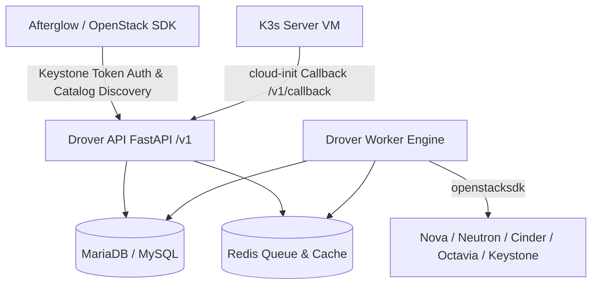

# Drover OpenStack 기술 문서 체계 (Documentation Index)

Drover는 OpenStack 환경에서 K3s Kubernetes 클러스터의 라이프사이클 관리, 노드그룹 오토스케일링, 인프라 동기화(Reconciliation) 및 내구성 오퍼레이션을 제공하는 오픈스택 네이티브(OpenStack Native) 컨테이너 인프라 서비스입니다.

본 문서 집합은 Afterglow 서비스 연동 개발자, 클라우드 운영자 및 플랫폼 엔지위어를 위한 종합 기술 가이드와 Reference 사양을 제공합니다.

---

## 문서 목록 및 상호 참조

1. **[Afterglow 서비스 통합 및 엔드포인트 디스커버리 마이그레이션 가이드](afterglow-service-integration.md)**
   - Afterglow 서비스의 Keystone 카탈로그 기반 엔드포인트 자동 탐색(Discovery) 전환 가이드
   - 배포 및 카탈로그 검증 체크리스트 (`openstack catalog show container-infra`, `openstack endpoint list`)
   - 3단계 안전 전환 전략 (Shadow Discovery ➔ Service Proxy ➔ Direct Override Removal)
   - Python Afterglow 통합 코드 샘플 (`openstacksdk` Connection + `drover_sdk.register`)
   - 멱동성(`Idempotency-Key`), SSE 스트리밍 비동기 처리, 오퍼레이션 폴링 및 장애 대응 매트릭스

2. **[Drover Native v1 API 기술 Reference](drover-api-v1-reference.md)**
   - Drover 네이티브 REST, SSE, WebSocket API 전체 엔드포인트 카탈로그 (기계 읽기용 `/openapi.json` 안내 포함)
   - 헬스 체크, 테넌트 클러스터, 노드그룹, 템플릿, K8s 리소스 프록시, 인증서/웹셸, 오퍼레이션, 관리자 API, GPU 쿼터
   - 요청/응답 Key 스키마, HTTP 헤더(`X-Auth-Token`, `X-Project-Id`, `X-Openstack-Request-Id`, `Idempotency-Key`), SSE 이벤트 형식 및 에러 처리 모델

3. **[Drover 레거시 기능 커버리지 및 오픈스택 통합 사양서](drover-feature-coverage.md)**
   - 기능 그룹별 교체 및 마이그레이션 매핑 서열
   - OpenStack 연동 사양 (Nova, Neutron, Cinder, Octavia, Keystone, Barbican, Manila)
   - 보안 아키텍처 (비밀번호 미노출, 최소권한 Application Credentials, Callback CIDR 제한)
   - 동기화(Reconciliation), Stampede 오토스케일링 및 의도적 설계 제약사항 (Magnum Wire 호환성, Placement allocation 미지원)

---

## Drover 핵심 아키텍처 요약

* **Keystone Catalog Service**: `name: drover`, `type: container-infra`
* **Keystone Endpoints**: `public`, `internal`, `admin` 모두 `/v1` 엔드포인트 URL 등록 (예: `http://<controller>:8011/v1`)
* **인증 및 권한**: 프로젝트 범위 Keystone 토큰 (`X-Auth-Token`) 및 `oslo.policy` 기반 RBAC (`drover:clusters:*`, `drover:operations:*`, `drover:admin` 등)
* **SDK 패키지**: `drover-sdk` Python 라이브러리를 통해 `conn.drover` 바인딩 및 카탈로그 자동 인지 사용

---

## 관련 링크 및 공식 참조
* [OpenStack SDK 공식 문서](https://docs.openstack.org/openstacksdk/latest/)
* [OpenStackClient CLI 공식 문서](https://docs.openstack.org/python-openstackclient/latest/)
