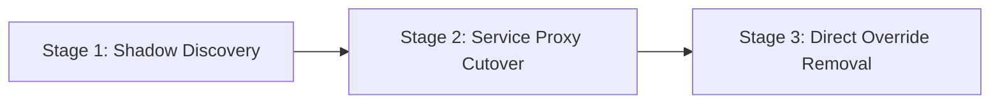

# Afterglow 서비스 통합 및 엔드포인트 디스커버리 마이그레이션 가이드

본 문서는 **Afterglow** 서비스 및 관련 마이크로서비스가 하드코딩된 서비스 URL이나 개별 환경변수 방식에서 탈피하여, OpenStack Keystone 서비스 카탈로그(Service Catalog) 기반 엔드포인트 자동 탐색(Discovery) 방식으로 전환하는 표준 절차와 운영 지침을 기술합니다.

---

## 1. 개요 및 아키텍처 전환 배경

Drover 서비스는 Magnum REST wire 호환 형식이 아닌 **Drover 네이티브 `/v1` API**를 제공합니다. Keystone 서비스 카탈로그에 표준 서비스 타입으로 등록되어 클라이언트가 중앙 카탈로그에서 엔드포인트를 동적으로 검색하여 호출합니다.

### 핵심 구성 사양
* **Keystone Service Name**: `drover`
* **Keystone Service Type**: `container-infra` (새로운 SDK 패키지 `drover-sdk`가 `container-infra` 서비스 타입에 `drover` 앨리어스를 등록함)
* **Keystone Endpoints**: `public`, `internal`, `admin` 모든 인터페이스 엔드포인트 URL이 `/v1`으로 종료됨 (예: `http://openstack.example.com:8011/v1`)
* **인증 모델**: 호출자의 프로젝트 범주 Keystone 토큰 (`X-Auth-Token` 필수, 선택적 `X-Project-Id` 헤더)
* **설정 관리 단순화**: Afterglow 서비스의 기존 직접 API URL 설정(`DROVER_SERVICE_URL` 등)을 완전히 제거하고 Keystone 인증 정보(`auth_url`, `token` 또는 credentials)만으로 카탈로그 디스커버리를 수행합니다.

---

## 2. 배포 및 카탈로그 검증 체크리스트 (Deployment Checklist)

Kolla-Ansible 또는 컨트롤러 노드 배포 후, Afterglow 통합을 진행하기 전 Keystone 서비스 카탈로그 및 엔드포인트 등록 상태를 CLI로 검증해야 합니다.

### 2.1 CLI 검증 명령 및 기대 출력

[OpenStackClient CLI 공식 문서](https://docs.openstack.org/python-openstackclient/latest/) 규격에 따라 다음 명령어로 `container-infra` 서비스 및 엔드포인트를 확인합니다.

```bash
# 1. Keystone 카탈로그 서비스 확인
openstack catalog show container-infra
```
**기대 출력 예시**:
```text
+-----------+----------------------------------+
| Field     | Value                            |
+-----------+----------------------------------+
| endpoints | RegionOne                        |
|           |   internal: http://10.0.0.10:8011/v1 |
|           |   public: http://10.0.0.10:8011/v1   |
|           |   admin: http://10.0.0.10:8011/v1    |
| id        | a1b2c3d4e5f67890123456789abcdef0  |
| name      | drover                           |
| type      | container-infra                  |
+-----------+----------------------------------+
```

```bash
# 2. 등록된 엔드포인트 상세 목록 조회
openstack endpoint list --service container-infra
```
**기대 출력 예시**:
```text
+----------------------------------+-----------+--------------+--------------+---------+-----------+--------------------------+
| ID                               | Region    | Service Name | Service Type | Enabled | Interface | URL                      |
+----------------------------------+-----------+--------------+--------------+---------+-----------+--------------------------+
| 11111111111111111111111111111111 | RegionOne | drover       | container-in | True    | public    | http://10.0.0.10:8011/v1 |
| 22222222222222222222222222222222 | RegionOne | drover       | container-in | True    | internal  | http://10.0.0.10:8011/v1 |
| 33333333333333333333333333333333 | RegionOne | drover       | container-in | True    | admin     | http://10.0.0.10:8011/v1 |
+----------------------------------+-----------+--------------+--------------+---------+-----------+--------------------------+
```

### 2.2 Kolla-Ansible 배포 환경 설정
`deploy/kolla/defaults/main.yml` 배포 설정이 아래와 같이 적용되어 있는지 확인합니다:
- `drover_keystone_service_name: "drover"`
- `drover_keystone_service_type: "container-infra"`
- `drover_replace_magnum_catalog: false` (기존 Magnum 서비스와의 충돌 방지 가드; Ansible 모듈을 통한 자동 인플레이스 교체는 지원되지 않으며, Magnum 교체 시 사전 수동 카탈로그 제거(`openstack service delete magnum`) 후 배포 진행)

---

## 3. 안전한 전환 절차 (Safe Rollout 3-Stage Strategy)

Afterglow 서비스의 가동 중단 없이 카탈로그 디스커버리로 전환하기 위해 다음 3단계 롤아웃 전략을 준수합니다.



### Stage 1: Shadow Discovery (디스커버리 검증 및 섀도링)
- Afterglow 서비스 시작 시 `openstacksdk` 커넥션을 생성하고 `drover_sdk.register(conn)`을 실행하여 Keystone 카탈로그 조회가 정상 작동하는지 백그라운드 헬스 체크 로그를 수집합니다.
- 실제 트래픽 요청은 기존 환경변수 URL로 처리하되 카탈로그 불일치 유무를 모니터링합니다.

### Stage 2: Service Proxy Cutover (서비스 프록시 무중단 전환)
- Afterglow 비즈니스 로직의 API 호출부를 `conn.drover` 프록시 메서드(`clusters()`, `create_cluster()`, `get_cluster()` 등)로 전환합니다.
- `SERVICE_DROVER_INTERNAL_URL` 환경변수를 비상용(Emergency Fallback)으로 유지합니다.

### Stage 3: Direct Override Removal (직접 URL 설정 영구 제거)
- 카탈로그 탐색의 안정성이 입증되면 Afterglow 배포 템플릿/Kubernetes ConfigMap/환경변수에서 `SERVICE_DROVER_INTERNAL_URL` 및 직접 URL 설정을 완전히 제거합니다.
- `SERVICE_DROVER_INTERNAL_URL`은 오직 카탈로그 장애 조치 또는 로컬 격리 테스트 환경에서만 임시 비상 오버라이드로 사용해야 합니다.

---

## 4. Python Afterglow 통합 코드 샘플 (Code Examples)

[OpenStack SDK 공식 문서](https://docs.openstack.org/openstacksdk/latest/) 및 `drover-sdk` 규격에 따른 Python 작성 예시입니다.

```python
import json
import os
import time

from openstack import connection

import drover_sdk


def get_afterglow_drover_client():
    """Use the caller's project-scoped Keystone token and catalog endpoint."""
    conn = connection.Connection(
        auth_url=os.environ["OS_AUTH_URL"],
        auth_type="token",
        token=os.environ["OS_TOKEN"],
        project_id=os.environ["OS_PROJECT_ID"],
        region_name=os.environ.get("OS_REGION_NAME", "RegionOne"),
        interface="internal",
    )
    # Normal production configuration leaves SERVICE_DROVER_INTERNAL_URL unset.
    return drover_sdk.register(conn)


def create_and_monitor_cluster():
    drover = get_afterglow_drover_client()
    idempotency_key = "afterglow-req-cluster-001"
    operation_id = None

    try:
        for raw_line in drover.create_cluster(
            name="k3s-afterglow-prod",
            agent_count=3,
            master_count=1,
            os_type="ubuntu",
            stampede_enabled=True,
            idempotency_key=idempotency_key,
        ):
            if not raw_line.startswith("data: "):
                continue
            event = json.loads(raw_line.removeprefix("data: "))
            operation_id = event.get("operation_id", operation_id)
            print(event)
    except Exception:
        # If no event exposed the operation ID, retry only the create request
        # with the same key and identical body; never synthesize a new key.
        if operation_id is None:
            raise

    if operation_id is None:
        raise RuntimeError("Drover did not return an operation ID")

    while True:
        operation = drover.get_operation(operation_id)
        print(operation["status"])
        if operation["status"] in {"SUCCEEDED", "FAILED", "CANCELLED"}:
            break
        time.sleep(1)

    if operation["status"] == "SUCCEEDED":
        cluster = drover.get_cluster(operation["cluster_id"])
        if cluster["status"] == "ACTIVE":
            kubeconfig_yaml = drover.kubeconfig(cluster["id"])
            print("Kubeconfig 수신 완료.")


if __name__ == "__main__":
    create_and_monitor_cluster()
```

---

## 5. 인터페이스, 멱동성, 오퍼레이션 폴링 및 네트워크 연동 사양

### 5.1 인터페이스 및 리전 선택 (Interface & Region Selection)
- `interface`: `internal` (기본값, VNF/내부 서비스 통신용), `public` (외부 망 직접 접근용), `admin` (시스템 관리자 전용).
- `region_name`: 다중 리전 OpenStack 배포 환경인 경우 Keystone 카탈로그의 지정 리전 엔드포인트를 자동 선택합니다.

### 5.2 재시도 및 멱동성 제어 (`Idempotency-Key`)
- 현재 서버가 멱동성 키를 저장·비교하는 외부 요청은 클러스터 생성 `POST /v1/clusters/async`뿐입니다.
- 같은 `(project_id, Idempotency-Key)`와 같은 요청 본문은 기존 생성 오퍼레이션을 재사용합니다. 같은 키와 다른 본문은 `409 Conflict`입니다.
- 스케일·삭제·노드그룹 변경은 내구성 Job으로 큐잉되지만 현재 응답에는 재사용 가능한 외부 멱동성 계약이나 operation ID가 없습니다. Afterglow는 이 요청들을 자동 재시도하지 말고, 요청 단위 상관관계 ID와 후속 클러스터 상태 조회로 처리해야 합니다.

### 5.3 SSE 스트리밍 연결 해제 및 폴링 복구 (SSE Reconnection)
- 클라이언트 네트워크 단선으로 SSE 연결이 끊기더라도 서버 측 `DroverJob` 및 `DroverOperation`은 백그라운드 Worker에서 안전하게 계속 실행됩니다.
- Afterglow 서비스는 연결 해제 시 다음 API로 오퍼레이션 상태 및 이벤트를 즉시 폴링하여 상태를 복구할 수 있습니다:
  - `GET /v1/operations/{operation_id}`: 작업의 최종 status (`QUEUED`, `RUNNING`, `WAITING_CALLBACK`, `SUCCEEDED`, `FAILED`, `CANCELLED`) 확인
  - `GET /v1/operations/{operation_id}/events?since_sequence=N`: 해당 작업의 시퀀스별 상세 진행 로그 복구 수집

---

## 6. 헬스 체크, 디스커버리 및 요청 상관관계 (Correlation)

### 6.1 헬스 체크 엔드포인트 구분
| 엔드포인트 | 목적 | 인증 여부 | 비고 |
| :--- | :--- | :--- | :--- |
| `GET /v1/health/live` | 프로세스 Liveness 체크 | Unauthenticated | 서비스 프로세스 생존 상태 (200 OK) |
| `GET /v1/health/ready` | 종속성 Readiness 체크 | Unauthenticated | MariaDB, Redis, Migration Ledger, Keystone Credentials 검증 |
| `GET /v1/health` | 하위 호환 Liveness | Unauthenticated | 이전 호환용 단순 200 OK |
| `GET /v1/clusters/health` | 테넌트 클러스터 헬스 | Authenticated | 호출자 테넌트 클러스터들의 K3s APIReachability 및 Node 헬스 종합 |

### 6.2 correlation ID (`X-Openstack-Request-Id`)
- 모든 API 요청 및 응답에는 `X-Openstack-Request-Id` 헤더가 포함되며, 서버 단 구성 로그 및 `DroverOperationEvent` 페이로드에 자동 기록됩니다.
- Afterglow 서비스는 분산 트레이싱을 위해 자체 요청 ID를 전달하거나 응답 헤더의 Request ID를 저장하여 운영 모니터링 시 추적성을 유지해야 합니다.

---

## 7. 롤백 및 운영 장애 대응 매트릭스 (Rollback & Failure Matrix)

| 장애 상황 (Failure Scenario) | 원인 및 진단 방식 | 시스템 자동 동작 (System Behavior) | Afterglow 권장 대응 절차 (Action Required) |
| :--- | :--- | :--- | :--- |
| **Keystone 카탈로그 미조회** | Keystone 서비스 등록 누락 또는 네트워크 차단 | `drover_sdk` 예외 발생 (`EndpointNotFound`) | `openstack catalog show container-infra` 검증 후 Kolla `register.yml` 재실행. 비상 시에만 `SERVICE_DROVER_INTERNAL_URL` 임시 설정 |
| **Keystone 토큰 만료 (401 Unauthorized)** | 호출자의 Keystone 토큰 유효기간 초과 | HTTP 401 및 `Invalid or expired Keystone token` 응답 | 호출자 토큰 재발급 후 API 요청 재시도 |
| **권한 부족 (403 Forbidden)** | 템플릿 관리 등 관리자 전용 API에 일반 프로젝트 토큰 사용 | HTTP 403 및 Policy rejection 응답 | Keystone 역할(`admin`) 확인 및 권한 요청 |
| **SSE 스트림 단선 (Stream Disconnect)** | 클라이언트 타임아웃 또는 프록시 연결 끊김 | 백그라운드 Worker에서 자원 생성을 계속 진행 (`WAITING_CALLBACK` ➔ `RUNNING`) | `GET /v1/operations/{operation_id}` 조회를 통해 수동 폴링 전환 |
| **cloud-init 콜백 타임아웃** | VM 인스턴스 네트워크 미연결 또는 cloud-init 실패 | 30분 콜백 미수신 시 작업 `FAILED` 전환 및 생성 자원 롤백 실행 | `get_operation_events()`를 통해 cloud-init 단계 오류 확인 후 네트워크/이미지 점검 |
| **중복 생성 요청 (409 Conflict)** | 동일 멱동성 키에 서로 다른 페이로드 전송 | HTTP 409 Conflict 반환 | 멱동성 키 생성 로직 점검 또는 새로운 UUID 멱동성 키 사용 |

---

## 상호 문서 참조
* [Drover 기술 문서 인덱스](README.md)
* [Drover Native v1 API 기술 Reference](drover-api-v1-reference.md)
* [Drover 레거시 기능 커버리지 및 오픈스택 통합 사양서](drover-feature-coverage.md)
