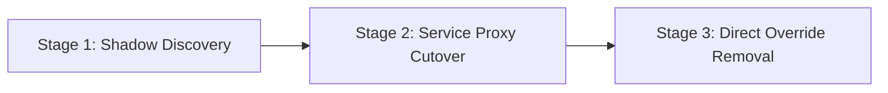

# Afterglow 서비스 통합 및 엔드포인트 디스커버리 마이그레이션 가이드

본 문서는 **Afterglow** 서비스 및 관련 마이크로서비스가 하드코딩된 서비스 URL이나 개별 환경변수 방식에서 탈피하여, OpenStack Keystone 서비스 카탈로그(Service Catalog) 기반 엔드포인트 자동 탐색(Discovery) 방식으로 전환하는 표준 절차와 운영 지침을 기술합니다.

---

## 1. 개요 및 아키텍처 전환 배경

Drover 서비스는 Magnum REST wire 호환 형식이 아닌 **Drover 네이티브 `/v1` API**를 제공합니다. Keystone catalog에는 service name과 service type이 모두 `drover`로 등록되며, `drover-sdk`는 이를 SDK service로 노출하고 `container-infra`를 alias로 지원합니다. 이 문서는 현재 구현과 혼동하지 않도록 아래 전환 절차를 **통합 rollout 계획/운영 체크리스트**로 다룹니다.

### 핵심 구성 사양
* **Keystone Service Name**: `drover`
* **Keystone Service Type**: `drover` (`container-infra`는 Keystone type이 아니라 `drover-sdk`의 SDK alias)
* **Keystone Endpoints**: `public`, `internal`, `admin` 모든 인터페이스 엔드포인트 URL이 `/v1`으로 종료됨 (예: `http://openstack.example.com:8011/v1`)
* **인증 모델**: 호출자의 프로젝트 범위 Keystone 토큰 (`X-Auth-Token` 필수, 선택적 `X-Project-Id` 헤더). Drover는 서비스 자격으로 catalog의 `identity` internal endpoint를 해석해 토큰 검증·관리자 역할 조회에 사용하며, internal endpoint 실패 시 external/public fallback을 하지 않는다.
* **설정 관리**: production catalog discovery는 Keystone 인증정보와 endpoint를 사용한다. `SERVICE_DROVER_INTERNAL_URL` 같은 직접 URL override는 rollout 계획의 비상/격리 테스트 경계로만 취급한다.
* **Execution authority (published 0.4.4; production cutover held)**: durable mutation은 requester-owned per-operation trust(`impersonation=True`), continuous Stampede/reconcile/health는 caller-owned restricted control credential입니다. guest plugins에는 별도 guest credential을 렌더링합니다. tenant manager user/password/app credential 생성·사용과 Afterglow provisioning intents는 제거됐습니다. 2026-10-07 로컬 suite·native loopback SDK·disposable MariaDB ledger 증거만 있으며 live Keystone/OpenStack/K3s 검증은 없습니다. trust와 app credential 발급은 Keystone이 app-credential/trust-scoped token의 trust·app-credential 관리를 막으므로 Afterglow는 사용자의 일반 project-scoped token(password/federation 등)을 전달해야 합니다 **[INFERENCE: Keystone master source 기준, 배포 cloud 미검증]**.

---

## 2. 배포 및 카탈로그 검증 체크리스트 (Deployment Checklist)

Kolla-Ansible 또는 컨트롤러 노드 배포 후, Afterglow 통합을 진행하기 전 Keystone 서비스 카탈로그 및 엔드포인트 등록 상태를 CLI로 검증해야 합니다.

### 2.1 CLI 검증 명령 및 기대 출력

[OpenStackClient CLI 공식 문서](https://docs.openstack.org/python-openstackclient/latest/) 규격에 따라 다음 명령어로 `drover` 서비스 및 엔드포인트를 확인합니다.

```bash
# 1. Keystone 카탈로그 서비스 확인
openstack catalog show drover
```
**기대 출력 예시**:
```text
+-----------+----------------------------------+
| Field     | Value                            |
+-----------+----------------------------------+
| endpoints | RegionOne                        |
|           |   internal: http://10.0.0.10:8011/v1 |
|           |   public: http://10.0.0.10:8011/v1   |
|           |   admin: http://10.0.0.10:8011/v1    |
| id        | a1b2c3d4e5f67890123456789abcdef0  |
| name      | drover                           |
| type      | drover                           |
+-----------+----------------------------------+
```

```bash
# 2. 등록된 엔드포인트 상세 목록 조회
openstack endpoint list --service drover
```
**기대 출력 예시**:
```text
+----------------------------------+-----------+--------------+--------------+---------+-----------+--------------------------+
| ID                               | Region    | Service Name | Service Type | Enabled | Interface | URL                      |
+----------------------------------+-----------+--------------+--------------+---------+-----------+--------------------------+
| 11111111111111111111111111111111 | RegionOne | drover       | drover      | True    | public    | http://10.0.0.10:8011/v1 |
| 22222222222222222222222222222222 | RegionOne | drover       | drover      | True    | internal  | http://10.0.0.10:8011/v1 |
| 33333333333333333333333333333333 | RegionOne | drover       | drover      | True    | admin     | http://10.0.0.10:8011/v1 |
+----------------------------------+-----------+--------------+--------------+---------+-----------+--------------------------+
```

### 2.2 Kolla-Ansible 배포 환경 설정
Kolla catalog registration의 source authority는 `deploy/kolla/ansible/roles/drover/tasks/preconditions_keystone.yml`이다.
- `service_ks_register_services`에 `name: drover`, `type: drover`와 public/internal/admin root endpoints가 정의되어 있다. SDK는 root 또는 `/v1` catalog URL을 받아 versioned API로 연결한다. 위 `/v1` URL은 지원되는 예시이지 Kolla 기본 등록값은 아니다.
- 기존 설치의 `deploy`에서 DB·Keystone resource 재생성만 건너뛰려면 `drover_run_preconditions: false`를 사용할 수 있다(`defaults/main.yml`, `tasks/deploy.yml`). 기존 DB/schema·서비스 사용자·catalog가 확인된 경우에만 적용한다. migration bootstrap과 API/Worker start는 생략되지 않는다. 신규 설치는 기본 `true`를 유지한다. 2026-10-06 DMSLab 적용 근거와 실제 배포·외부 인증 결과는 [0.4.3 배포 기록](release-0.4.0.md#tagged-043-verification-2026-10-06)을 참조한다.

---

## 3. 안전한 전환 절차 (Safe Rollout 3-Stage Strategy — 계획)

아래 3단계는 catalog discovery로 전환할 때 사용할 **계획과 확인 항목**이다. 이 문서의 존재나 예제 코드는 실제 rollout 완료, production traffic cutover, direct override 제거를 증명하지 않는다. 현재 서비스 경계와 구현은 루트 [`ARCHITECTURE.md`](../ARCHITECTURE.md)와 source를 기준으로 판단한다.


```mermaid
graph LR
    Stage1[Stage 1: Shadow Discovery] --> Stage2[Stage 2: Service Proxy Cutover]
    Stage2 --> Stage3[Stage 3: Direct Override Removal]
```

### Stage 1: Shadow Discovery (디스커버리 검증 및 섀도링 계획)
- Afterglow 서비스 시작 시 `openstacksdk` 커넥션을 생성하고 `drover_sdk.register(conn)`을 실행하여 Keystone catalog 조회가 정상 작동하는지 별도 health check로 확인한다.
- 실제 트래픽과 catalog 결과의 차이를 관찰하되, 이 문서는 해당 트래픽 전환이 이미 완료됐다고 주장하지 않는다.

### Stage 2: Service Proxy Cutover (서비스 프록시 전환 계획)
- Afterglow 비즈니스 로직의 API 호출부를 `conn.drover` proxy 메서드로 전환한다.
- `SERVICE_DROVER_INTERNAL_URL` 환경변수는 필요한 격리 테스트/비상 복구 경계에서만 유지하며, rollout 전제와 현재 production 설정을 별도로 확인한다.

### Stage 3: Direct Override Removal (직접 URL 설정 제거 계획)
- catalog endpoint와 proxy 동작을 검증한 뒤에만 배포 템플릿/ConfigMap의 직접 URL override 제거 여부를 결정한다.
- override를 제거하거나 유지했다는 완료 판단은 이 계획 문서가 아니라 실제 배포 설정과 source 검토로 기록한다.

---

## 4. Python Afterglow 통합 코드 샘플 (Code Examples)

[OpenStack SDK 공식 문서](https://docs.openstack.org/openstacksdk/latest/) 및 `drover-sdk` 규격에 따른 Python 작성 예시입니다.

```python
import json
import os
import time

from openstack import connection

import drover_sdk


def get_afterglow_drover_client():
    """Use the caller's project-scoped Keystone token and catalog endpoint."""
    conn = connection.Connection(
        auth_url=os.environ["OS_AUTH_URL"],
        auth_type="token",
        token=os.environ["OS_TOKEN"],
        project_id=os.environ["OS_PROJECT_ID"],
        region_name=os.environ.get("OS_REGION_NAME", "RegionOne"),
        interface="internal",
    )
    # Normal production configuration leaves SERVICE_DROVER_INTERNAL_URL unset.
    return drover_sdk.register(conn)


def create_and_monitor_cluster():
    drover = get_afterglow_drover_client()
    idempotency_key = "afterglow-req-cluster-001"
    operation_id = None

    try:
        for raw_line in drover.create_cluster(
            name="k3s-afterglow-prod",
            agent_count=3,
            master_count=1,
            os_type="ubuntu",
            stampede_enabled=True,
            idempotency_key=idempotency_key,
        ):
            if not raw_line.startswith("data: "):
                continue
            event = json.loads(raw_line.removeprefix("data: "))
            operation_id = event.get("operation_id", operation_id)
            print(event)
    except Exception:
        # If no event exposed the operation ID, retry only the create request
        # with the same key and identical body; never synthesize a new key.
        if operation_id is None:
            raise

    if operation_id is None:
        raise RuntimeError("Drover did not return an operation ID")

    while True:
        operation = drover.get_operation(operation_id)
        print(operation["status"])
        if operation["status"] in {"SUCCEEDED", "FAILED", "CANCELLED"}:
            break
        time.sleep(1)

    if operation["status"] == "SUCCEEDED":
        cluster = drover.get_cluster(operation["cluster_id"])
        if cluster["status"] == "ACTIVE":
            kubeconfig_yaml = drover.kubeconfig(cluster["id"])
            print("Kubeconfig 수신 완료.")


if __name__ == "__main__":
    create_and_monitor_cluster()
```

---

## 5. 인터페이스, 멱동성, 오퍼레이션 폴링 및 네트워크 연동 사양

### 5.1 인터페이스 및 리전 선택 (Interface & Region Selection)
- `interface`: `internal` (기본값, VNF/내부 서비스 통신용), `public` (외부 망 직접 접근용), `admin` (시스템 관리자 전용).
- `region_name`: 다중 리전 OpenStack 배포 환경인 경우 Keystone 카탈로그의 지정 리전 엔드포인트를 자동 선택합니다.

### 5.2 재시도 및 멱동성 제어 (`Idempotency-Key`)
- 현재 서버가 멱동성 키를 저장·비교하는 외부 요청은 클러스터 생성 `POST /v1/clusters/async`뿐입니다.
- 같은 `(project_id, Idempotency-Key)`와 같은 요청 본문은 기존 생성 오퍼레이션을 재사용합니다. 같은 키와 다른 본문은 `409 Conflict`입니다.
- 스케일·삭제·노드그룹 변경은 내구성 Job으로 큐잉되지만 현재 응답에는 재사용 가능한 외부 멱동성 계약이나 operation ID가 없습니다. Afterglow는 이 요청들을 자동 재시도하지 말고, 요청 단위 상관관계 ID와 후속 클러스터 상태 조회로 처리해야 합니다.

### 5.3 SSE 스트리밍 연결 해제 및 폴링 복구 (SSE Reconnection)
- create 등 내구성 Job 기반 SSE의 연결이 끊겨도 작업은 Worker에서 계속됩니다. 현재 tenant `delete-async`는 caller connection을 사용하는 직접 SSE 삭제 경로이므로 동일한 내구성/disconnect 계약을 적용하지 않습니다.
- Afterglow 서비스는 연결 해제 시 다음 API로 오퍼레이션 상태 및 이벤트를 즉시 폴링하여 상태를 복구할 수 있습니다:
  - `GET /v1/operations/{operation_id}`: 작업의 최종 status (`QUEUED`, `RUNNING`, `WAITING_CALLBACK`, `SUCCEEDED`, `FAILED`, `CANCELLED`) 확인
  - `GET /v1/operations/{operation_id}/events?since_sequence=N`: 해당 작업의 시퀀스별 상세 진행 로그 복구 수집


### 5.4 Stampede 오토스케일링 상태 및 이벤트 연동 사양 (Autoscaling UI Integration)
Afterglow 대시보드 및 BFF에서 테넌트 클러스터의 오토스케일링 설정, 마지막으로 관측한 용량, 스케줄링 결정 및 변경 이력을 표시하기 위한 연동 사양입니다. 상태 GET은 Kubernetes를 새로 조회하지 않으므로 `observed_at`으로 stale 관측을 구분해야 합니다.

1. **오토스케일링 모드 전환**:
   - `POST /v1/clusters/{cluster_id}/stampede/enable`: `ACTIVE` cluster와 Stampede 활성 agent nodegroup 및 active control credential이 필요합니다. legacy cluster는 먼저 재인가해야 하고 control이 없으면 409입니다.
   - `POST /v1/clusters/{cluster_id}/stampede/disable`: 클러스터 비활성화 (이미 큐에 진입한 내구성 작업은 완료까지 유지).

2. **종합 상태 및 노드그룹 메트릭 조회 (`GET /v1/clusters/{cluster_id}/stampede`)**:
   - `policy`: 클러스터에 적용된 주기(`interval`), 유휴 안정화 윈도우(`scale_down_window`, 300–600초), 쿨다운(`scale_up_cooldown`, `scale_down_cooldown`), 저사용량 임계값(`scale_down_threshold`), 헤드룸 계수(`resource_headroom_factor`).
   - `active_operation_ids`: 현재 노드그룹에서 실행 중인 비동기 오퍼레이션 ID 목록.
   - `nodegroups`: 노드그룹별 정밀 상태 배열:
     - `node_count`/`desired_count` (예약한 목표 수량), `tracked_count` (MariaDB에 추적 중인 VM 수; 현재 Nova 존재 여부의 실시간 보장이 아님), `ready_count` (마지막 관측에서 K3s Ready인 노드 수; 미관측 시 null), `in_flight` (현재 진행 중인 증설 수량). `ready_count`는 GPU 준비성을 뜻하지 않습니다. GPU는 `capacity.allocatable.gpu`와 `stampede_state.ready_nodes`/`failed_nodes`, 최종 operation 상태를 함께 확인합니다.
     - `capacity`: allocatable / requested / free 리소스 요약 (CPU millicores, RAM bytes, NVIDIA GPU slots, Pod slots).
     - `pending_assignments`: 노드그룹에 배정된 미스케줄 Pod 목록 및 필요 리소스.
     - `blocked_reasons`: Pending Pod 분류 사유 (`pvc_unbound`, `not_resource_shortage`, `unsupported_pod_affinity`, `no_matching_nodegroup` 등). flavor·quota·cooldown 등 노드그룹 결정 차단은 `last_blocked_reason`으로 표시합니다.
     - `last_decision`: 최근 스케줄러 동작 (`scale_up_queued`, `scale_up_complete`, `scale_down_queued`, `scale_down_complete`, `stabilizing`, `within_capacity`, `observation_failed` 등).
     - `last_blocked_reason`: 최근 차단 상세 사유. CPU/GPU Node가 Ready가 되지 않으면 `node_not_ready`, Ready 이후 요청한 GPU allocatable이 부족하면 `gpu_not_allocatable`입니다. 부분 provisioning은 `provision_failed`가 우선하며, 여러 worker 중 join 실패가 있으면 GPU 부족보다 우선 표시합니다. 그 밖에 `scale_down_cooldown`, `min_size_reached` 등이 있습니다.
     - `quota_state.allowed`는 admission 단계의 결과입니다. Nova quota나 GPU 호스트의 현재 여유를 예약·보장하지 않으며, 이후 provisioning 실패는 operation 상태로 확인합니다.
     - admission 장애/401/malformed/transport 실패는 fail closed 입니다. Drover의 경계는 `/api/v1/internal/k3s/gpu-admission`에 admission token header와 project/flavor를 보내는 것뿐입니다. planner는 URL 설정 시 CPU flavor도 판정을 기다리고, `autoscale.provision_nodegroup_vms`는 기존 VM 복구가 아닌 각 새 native GPU worker create 전에 admission을 재검사합니다. Afterglow provisioning intent 요청은 없습니다. Nova/Cinder 생성은 Drover의 bound authority로 직접 실행합니다. live-count admission은 capacity reservation이 아니며 URL 미설정 독립 환경에서는 native Nova quota를 따릅니다. 과거 Afterglow service-user scope 장애는 새 Drover 실행 권한의 live 검증 증거가 아닙니다.

3. **이벤트 타임라인 (`GET /v1/clusters/{cluster_id}/stampede/events?limit=50`)**:
   - Redis 기반 보조 Activity 피드로, 스케일링 시작(`started`), 완료(`success`), 실패(`failed`), 보류(`skipped`) 이벤트와 상세 메타데이터(노드명, flavor, Pod 수 등)를 역순(최신순)으로 제공합니다.
   - Redis 장애 시 빈 목록을 반환할 수 있습니다. 이력의 정본은 `last_operation_id` 및 `active_operation_ids`로 조회하는 `/v1/operations/{operation_id}`와 `/events`입니다.


### 5.5 Requester trust와 resource reauthorization

1. **현재 requester만 위임**: durable create/scale/DELETE 및 nodegroup sizing/delete, admin scale/delete는 target-project caller token으로 trust를 만듭니다. required roles 모두와 현재 held optional만 위임하며 admin/manager 위임과 tenant-scoped service identity는 없습니다. trust record의 scope/impersonation/role subset/expiry와 token principal/project/trustee/expiry를 확인하고 connection마다 enabled principal/project와 held roles/capability를 재검증합니다. trust/app-credential token은 admitted role IDs를 모두 포함해야 하며 implied-role 확장은 허용하되 admin/manager token roles는 거부합니다. callback/HA/agent continuation과 해당 create rollback은 원래 create delegation을 이어 사용합니다.
2. **실패/DELETE/sweep**: revoked/mismatched/missing/too-near-expiry authority는 terminal이고 통신 장애는 attempt-fenced retry입니다. caller token/password는 persist하지 않습니다. idle이면 `released`로 전환하고 job 종료 후와 300초 sweep에서 released/revoked trust를 자신의 impersonating trust-scoped password token으로 DELETE합니다(project selector 없음). 성공/404는 `deleted`, Unauthorized/Forbidden은 released/revoked와 `trust inert until expiry`, 통신 장애는 다음 sweep 재시도입니다. expiry 뒤 Keystone GET 404가 확인되면 `expired`입니다. TTL은 DELETE 불가/장애의 fallback bound이며 정상 완료 trust를 단순히 expiry까지 방치하지 않습니다. 미커밋 trust는 caller token으로 삭제 시도합니다.
3. **Keystone 회수 제한**: [master trusts.py](https://github.com/openstack/keystone/blob/master/keystone/api/trusts.py)의 `_check_delegated_token`은 app-credential/OAuth/EC2를 차단하지만 ordinary trust token은 차단하지 않습니다. `identity:delete_trust`는 admin/trustor를 허용하고 impersonation token의 user는 trustor이므로 Drover는 trust 자체 token으로 DELETE합니다. [Master users.py](https://github.com/openstack/keystone/blob/master/keystone/api/users.py)의 `_block_delegated_token_app_creds`와 `_check_unrestricted_application_credential`은 trust/OAuth/EC2와 restricted app-credential token의 추가 app-credential 관리를 막으므로 app credential은 owner의 non-delegated token으로 회수합니다. upstream source 검토이지 배포 cloud 검증이 아닙니다. `tests/test_native_trust_loopback.py`는 실제 SDK의 HTTP create/project-less OS-TRUST auth/DELETE 및 revoked-role terminal 경계를 synthetic loopback provider에서 정의합니다(test-defined, 문서 slice에서는 실행하지 않음).
4. **Control vs guest**: caller token으로 restricted control/필요한 guest를 held delegated-role subset으로 발급·암호화 저장합니다. control은 Drover 전용, guest는 cloud plugin 전용입니다. connection마다 Stampede는 owner scale capability, reconcile/health는 get capability와 token scope/roles를 재검증합니다. legacy active control 없음은 `reauthorization_required`입니다. reconcile authority failure와 credential missing(non-required drift)은 그 자체로 cluster를 ERROR로 바꾸지 않아 ACTIVE-only 재인가를 막지 않습니다. health Nova floating-IP 조회 실패는 private IP를 유지하며 다른 authority로 우회하지 않습니다.
5. **Afterglow 재인가 UI/BFF**: `conn.drover.cluster_authorization(id)`는 secret 없는 credential states/backlog를 조회합니다. `conn.drover.reauthorize_cluster(id)`는 `POST /v1/clusters/{id}/authorization`(body 없음)으로 `ACTIVE`이며 다른 mutation이 없는 cluster에 staged generation을 만들고 202와 job/operation ID를 반환합니다. UI는 operation을 poll하고 active generation을 확인해야 합니다; 202나 `authorized=true` row 존재는 current Keystone/live rollout 검증이 아닙니다.
6. **Guest rollout**: worker는 current reauthorize capability와 staged token 검증 후 `kube-system/cloud-config`, `manila-cloud-secret` Secret 및 Octavia Ingress `octavia-ingress-controller-config` ConfigMap의 credential keys만 교체합니다. 참조하는 Deployment/DaemonSet/StatefulSet restart와 rollout wait를 수행합니다. KMS required/legacy detect에서는 control-plane host별 privileged hostPID Job이 Secret env + `nsenter`로 `/etc/kubernetes/cloud.conf`(있으면), `/etc/kubernetes/barbican-cloud.conf`를 rewrite하고 `barbican-kms.service` restart/active/socket을 확인합니다. 마지막 Secret-write probe 성공 뒤에만 atomic activation합니다.
7. **Retirement/UI 상태**: activation은 이전 active/다른 staged를 retiring으로 만들고 secret을 지웁니다. 부분 실패는 staged `last_error`와 이전 active를 유지하며 guest 객체 자동 원복은 보장하지 않습니다. `conn.drover.retire_cluster_credentials(id)` / `POST .../authorization/retire`는 caller token으로 caller 소유 retiring credential만 삭제합니다. UI는 남은 `owner_revocation_required`를 표시해야 하고 legacy owner 없는 항목은 operator 회수 대상입니다.
8. **삭제는 creator와 독립**: durable DELETE/admin delete는 현재 delete actor의 trust를 씁니다. tenant DELETE는 admission에서 caller 소유 credential을 caller token으로 동기 회수 시도하며 완료 시 다른 owner/legacy secret을 지우고 revocation backlog를 남깁니다. 현재 tenant `delete-async`는 caller connection으로 직접 실행하는 SSE 경로이며 durable job/trust continuation은 아닙니다; disconnect 뒤 계속된다고 보장하지 않습니다. 어느 경로도 creator account 복구나 tenant manager fallback을 요구하지 않습니다.

설정은 TOML `[drover]`의 `operation_trust_ttl_seconds=14400`(900–86400), `operation_trust_min_remaining_seconds=300`(60–3600, TTL보다 작음), `delegated_required_roles=["member"]`(nonempty), `delegated_optional_roles=["load-balancer_member"]`, `guest_rollout_timeout_seconds=600`(60–3600)입니다. Settings/Kolla는 `drover_` prefix를 사용합니다. Barbican 기본 member/Octavia optional member-role의 실제 policy 충족은 **[INFERENCE]**이며 live 검증이 아닙니다.

### 5.6 Execution-authority upgrade와 설정 제거

1. manifest의 `004_execution_authority.sql`을 적용합니다. 새 worker로 구 mutation job을 시험 실행하지 않습니다.
2. admission/자동 mutation을 멈추고 구 worker로 pre-upgrade mutation 및 `WAITING_CALLBACK`/HA/agent 작업을 drain합니다. 구 job에는 delegation이 없으므로 새 worker는 terminal로 거부합니다.
3. 새 API/Worker로 cutover하고 legacy `ACTIVE` cluster를 authorized project operator가 재인가합니다. operation 성공, guest rollout 및 active generation을 확인합니다.
4. 그 뒤에만 `afterglow-cluster-mgr-*` 사용자와 옛 app credentials를 operator가 out of band 회수합니다. manager password rows를 새 권한으로 자동 이관하지 않습니다. 자세한 runbook은 [migration README](../drover/migrations/README.md#execution-authority-upgrade-004)입니다.

Settings와 Kolla의 `drover_afterglow_provisioning_url`, `drover_afterglow_provisioning_token`, `drover_afterglow_provisioning_token_file`을 운영 설정에서 제거합니다. TOML `afterglow_provisioning_url/token/token_file` 및 `DROVER_AFTERGLOW_PROVISIONING_TOKEN_FILE`도 더 이상 지원하지 않습니다. Kolla `tasks/config.yml`은 옛 `afterglow_k3s_provisioning_token` 파일을 제거합니다. `drover_afterglow_admission_url/token/token_file`, `DROVER_AFTERGLOW_ADMISSION_TOKEN_FILE`과 admission 파일은 유지합니다. 운영 secret 값은 문서/로그에 넣지 않습니다.

---

## 6. 헬스 체크, 디스커버리 및 요청 상관관계 (Correlation)

### 6.1 헬스 체크 엔드포인트 구분
| 엔드포인트 | 목적 | 인증 여부 | 비고 |
| :--- | :--- | :--- | :--- |
| `GET /v1/health/live` | 프로세스 Liveness 체크 | Unauthenticated | 서비스 프로세스 생존 상태 (200 OK) |
| `GET /v1/health/ready` | 종속성 Readiness 체크 | Unauthenticated | MariaDB, Redis, Migration Ledger, Keystone Credentials 검증 |
| `GET /v1/health` | 하위 호환 Liveness | Unauthenticated | 이전 호환용 단순 200 OK |
| `GET /v1/clusters/health` | 테넌트 클러스터 헬스 | Authenticated | 호출자 테넌트 클러스터들의 K3s APIReachability 및 Node 헬스 종합 |

### 6.2 correlation ID (`X-Openstack-Request-Id`)
- 모든 API 요청 및 응답에는 `X-Openstack-Request-Id` 헤더가 포함되며, 서버 단 구성 로그 및 `DroverOperationEvent` 페이로드에 자동 기록됩니다.
- Afterglow 서비스는 분산 트레이싱을 위해 자체 요청 ID를 전달하거나 응답 헤더의 Request ID를 저장하여 운영 모니터링 시 추적성을 유지해야 합니다.

---

## 7. 롤백 및 운영 장애 대응 매트릭스 (Rollback & Failure Matrix)

| 장애 상황 (Failure Scenario) | 원인 및 진단 방식 | 시스템 자동 동작 (System Behavior) | Afterglow 권장 대응 절차 (Action Required) |
| :--- | :--- | :--- | :--- |
| **Keystone 카탈로그 미조회** | Keystone 서비스 등록 누락 또는 네트워크 차단 | `drover_sdk` 예외 발생 (`EndpointNotFound`) | `openstack catalog show drover` 검증 후 Kolla `preconditions_keystone.yml` 재실행. 비상 시에만 `SERVICE_DROVER_INTERNAL_URL` 임시 설정 |
| **Keystone 토큰 만료 또는 internal identity 경로 실패 (401 Unauthorized)** | 호출자의 토큰 만료/폐기, internal identity endpoint 누락 또는 내부 VIP 연결 실패 | HTTP 401 및 `Invalid or expired Keystone token` 응답. 토큰 검증과 관리자 역할 조회는 internal endpoint만 사용하고 external/public URL로 우회하지 않음 | 호출자 토큰 상태와 `identity` internal catalog endpoint/VIP/TLS 연결을 각각 확인한 뒤 재시도 |
| **권한 부족 (403 Forbidden)** | 템플릿 관리 등 관리자 전용 API에 일반 프로젝트 토큰 사용 | HTTP 403 및 Policy rejection 응답 | Keystone 역할(`admin`) 확인 및 권한 요청 |
| **SSE 스트림 단선 (Stream Disconnect)** | 클라이언트 타임아웃 또는 프록시 연결 끊김 | 백그라운드 Worker에서 자원 생성을 계속 진행 (`WAITING_CALLBACK` ➔ `RUNNING`) | `GET /v1/operations/{operation_id}` 조회를 통해 수동 폴링 전환 |
| **cloud-init 콜백 타임아웃** | VM 네트워크/cloud-init 실패 | 30분 후 operation 실패; rollback은 같은 create delegation과 현재 requester 권한/남은 trust lifetime이 유효할 때만 실행 가능 | event와 inventory로 부분 자원을 확인하고 필요 시 현재 authorized delete actor로 정리; 자동 rollback 완료를 보장하지 않음 |
| **중복 생성 요청 (409 Conflict)** | 동일 멱동성 키에 서로 다른 페이로드 전송 | HTTP 409 Conflict 반환 | 멱동성 키 생성 로직 점검 또는 새로운 UUID 멱동성 키 사용 |
| **Resource authority revoked / legacy 없음** | owner disabled/role revoked/credential revoked 또는 active control 없음 | Stampede는 `authority_revoked`/`reauthorization_required`로 차단; 다른 identity fallback 없음 | 현재 authorized project operator로 `/authorization` 재인가 후 operation/guest rollout 확인 |
| **Guest rollout 부분 실패** | Secret/ConfigMap/host Job/rollout/Secret probe 실패 | staged `last_error`, 이전 active 유지; guest 객체 자동 원복 보장 없음 | operation과 authorization 상태로 실패 위치 확인, 이전 credential 조기 폐기 금지 |

---

## 상호 문서 참조
* [Drover 기술 문서 인덱스](README.md)
* [Drover Native v1 API 기술 Reference](drover-api-v1-reference.md)
* [Drover 레거시 기능 커버리지 및 오픈스택 통합 사양서](drover-feature-coverage.md)
