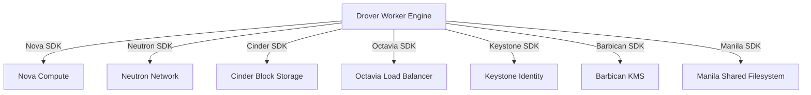

# Drover 레거시 기능 커버리지 및 오픈스택 통합 사양서

본 문서는 레거시 오퍼레이션 및 이전 직접 오픈스택 API 연동 방식 대비 **Drover 서비스의 기능 커버리지, 교체 매핑, 오픈스택 서비스 통합 구조, 보안 아키텍처 및 의도적 제약사항**을 상세히 기술합니다.

---

## 1. 레거시 기능 그룹별 교체 및 SDK 매핑 서열 (Feature Replacement Mapping)

Drover는 Magnum REST wire API의 드롭인 대체가 아니라, Afterglow가 직접 URL로 호출하던 K3s 관리 기능을 Keystone 카탈로그 기반 **Drover Native v1 API** 및 Python SDK (`drover-sdk`)로 전환하는 서비스입니다.

| 기능 그룹 (Functional Group) | 레거시 / 이전 방식 | Drover 네이티브 엔드포인트 교체 사양 | SDK (`drover-sdk`) 매핑 메서드 |
| :--- | :--- | :--- | :--- |
| **클러스터 라이프사이클** | Afterglow의 직접 Drover URL 호출 | `POST /v1/clusters/async`<br>`GET /v1/clusters`<br>`DELETE /v1/clusters/{cluster_id}` | `conn.drover.create_cluster()`<br>`conn.drover.clusters()`<br>`conn.drover.delete_cluster()` |
| **노드 스케일링** | 직접 REST 스케일 요청 | `PATCH /v1/clusters/{cluster_id}/scale`<br>`PATCH /v1/clusters/{cluster_id}/nodegroups/{nodegroup_id}` | `conn.drover.scale_cluster()`<br>`conn.drover.update_nodegroup()` |
| **클러스터 템플릿** | 직접 REST 템플릿 관리 | `GET /v1/cluster-templates`<br>`POST /v1/cluster-templates` | `conn.drover.cluster_templates()`<br>`conn.drover.create_cluster_template()` |
| **K8s 리소스 직접 제어** | 별도 kubectl 또는 직접 REST 호출 | `GET/POST/PUT/DELETE /v1/clusters/{cluster_id}/...` | `conn.drover.configmaps()`<br>`conn.drover.secrets()`<br>`conn.drover.pods()` |
| **인증서 및 CA 관리** | 직접 REST 인증서 호출 | `GET /v1/clusters/{cluster_id}/ca-certificate`<br>`GET /v1/clusters/{cluster_id}/certificate-expiry`<br>`POST /v1/clusters/{cluster_id}/rotate-certs` | `conn.drover.ca_certificate()`<br>`conn.drover.certificate_expiry()`<br>`conn.drover.rotate_certs()` |
| **대화형 클라우드 셸** | 노드 직접 SSH 접속 | `POST /v1/clusters/{cluster_id}/shell-ticket`<br>`WebSocket /v1/clusters/{cluster_id}/shell` | `conn.drover.create_shell_ticket()`<br>(웹브라우저/터미널 전용 WebSocket) |
| **오퍼레이션 트레이싱** | 비동기 상태 유실 위험 | `GET /v1/operations/{operation_id}`<br>`GET /v1/operations/{operation_id}/events` | `conn.drover.get_operation()`<br>`conn.drover.operation_events()` |

---

## 2. 오픈스택 서비스별 통합 사양 (OpenStack Service Integrations)

Drover는 클러스터 생성 및 관리를 위해 OpenStack 핵심 서비스들과 직접 통합되어 동적으로 자원을 프로비저닝하고 태그 기반 추적을 수행합니다.



### 2.1 Nova (Compute)
- K3s Master (Server) 및 Worker (Agent) 가상머신 프로비저닝.
- 노드 Flavor 검증 및 자원 정책 연동.
- VM 인터페이스 동적 연결/해제 (`POST/DELETE /v1/clusters/{cluster_id}/nodes/{vm_id}/interfaces`).
- 생성된 Nova 서버에는 지원되는 OpenStack 태그/메타데이터로 `drover.managed=true`, `drover.cluster_id=<cluster_id>`, `drover.operation_id=<operation_id>`가 기록되며, 지원하지 않는 자원은 관리 인벤토리의 ID로 추적합니다.

### 2.2 Neutron (Networking)
- 클러스터 전용 Security Group 및 보안 규칙 동적 생성/삭제.
- K3s API Server용 Floating IP (FIP) 및 Port 바인딩.
- `allowed_cidrs` 지정을 통한 K3s API 접근 IP 제어.

### 2.3 Cinder (Block Storage)
- K3s Server VM 부트 볼륨 (`boot_volume_size_gb`, 기본 30GB) 생성 및 가상머신 연결.
- **Cinder CSI Plugin**: 클러스터 내 Kubernetes 볼륨 동적 프로비저닝 지원 (`drover_cinder_csi_enabled: true`).

### 2.4 Octavia (Load Balancing)
- **K3s HA API Load Balancer**: Multi-master (`master_count=3`) 설정 시 K3s Control Plane API (Port 6443) HA 로드밸런서, Listener, Pool 및 Member 생성.
- **OCCM (OpenStack Cloud Controller Manager)**: Kubernetes Ingress / Service Type LoadBalancer 수용 및 Octavia 로드밸런서 자동 동기화 (`drover_occm_enabled: true`).

### 2.5 Keystone (Identity & Access)
- 사용자 요청 시 호출자의 `X-Auth-Token`을 통한 토큰 검증 및 프로젝트 스코프 확인.
- 서비스 카탈로그 자동 등록 (`drover_keystone_service_name: drover`, `drover_keystone_service_type: container-infra`).
- **클러스터 전용 Application Credentials**: OCCM, Cinder CSI, Manila CSI 플러그인을 위해 클러스터별 최소 권한의 Keystone Application Credential을 자동 발급하고 클러스터 삭제 시 즉시 파기.

### 2.6 Barbican & Manila (선택적 커스텀 연동)
- **Barbican KMS Plugin**: K3s Secret 암호화를 위한 KMS 바인딩 지원.
- **Manila CSI Plugin**: K3s Pod 공유 파일시스템(NFS/CephFS) 볼륨 프로비저닝 연동 (`drover_manila_csi_enabled`).

---

## 3. 배포 아키텍처 및 스키마 준비성 (Deployment & Schema Readiness)

Drover는 **Kolla-Ansible** 컨테이너 배포 환경을 표준으로 지원합니다.

```
deploy/kolla/
├── defaults/main.yml         # Kolla 기본 포트, 이미지, 시크릿 경로 설정
├── tasks/
│   ├── bootstrap.yml         # MariaDB 데이터베이스 및 계정 생성
│   ├── config.yml            # ConfigMap 및 drover.conf/policy.yaml 렌더링
│   ├── register.yml          # Keystone 서비스 카탈로그 및 엔드포인트 atomic 등록
│   └── deploy.yml            # 컨테이너 서비스 및 pre-start 마이그레이션 실행
└── templates/
    ├── drover.conf.j2        # Drover 메인 구성 파일 템플릿
    ├── drover-api.json.j2    # Kolla config_files 템플릿
    ├── drover-worker.json.j2 # Worker 컨테이너 템플릿
    └── drover-migrate.json.j2# Pre-start Migration 컨테이너 템플릿
```

### Schema Readiness 및 Pre-start Migration
- API 및 Worker 프로세스 시작 전, `drover-migrate` 컨테이너가 먼저 실행되어 `drover/migrations/manifest.txt` 및 `001_baseline.sql` 래저 체크섬을 검증하고 DB 마이그레이션을 안전하게 수행합니다.
- API 서버는 요청 수신 시 DB 마이그레이션이 완전히 적용되지 않았거나 Redis/Keystone 커넥션이 정상화되지 않은 경우 `/v1/health/ready`에서 HTTP 503을 반환하여 트래픽 입입을 방지합니다.

---

## 4. 보안, 인프라 동기화 및 오토스케일링 아키텍처

### 4.1 보안 아키텍처 (Security Architecture)
* **비밀번호 분리 및 마스킹**: 비밀번호, 암호화 키 등 민감한 데이터는 환경변수나 소스코드에 하드코딩되지 않으며, `/etc/drover/secrets/*` 파일 경로를 통해 읽어옵니다. 관리자 인벤토리 API(`GET /v1/admin/managed-resources`)는 시크릿 패턴을 자동으로 정규식 검사하여 마스킹 처리합니다.
* **cloud-init 보안**: cloud-init 설정 파일 권한은 파일시스템 모드 `0600`으로 제한되며, 클러스터 플러그인에 OpenStack 서비스 비밀번호가 미노출되도록 클러스터 전용 Application Credential을 주입합니다.
* **Callback CIDR 제한**: K3s Server cloud-init이 호출하는 `/v1/callback` 엔드포인트는 `drover_callback_allowed_cidrs` 허용목록에 등록된 IP 범위에서만 접근할 수 있도록 소스 IP 레벨에서 차단 검증합니다.

### 4.2 인프라 동기화 (Reconciliation Loop)
- **Worker Periodic Scan**: `drover-worker` 엔진은 설정된 주기(`drover_reconcile_interval`)마다 오픈스택 실제 자원(`ManagedOpenStackResource`) 상태와 DB의 원하는 클러스터 상태를 교차 검증합니다.
- **Orphan & Drift Detection**: OpenStack 자원이 임의 삭제되었거나 갱신된 경우 `drift_status` 및 `last_reconciled_at` 필드를 업데이트하고 클러스터를 경고/ERROR 상태로 전환합니다.

### 4.3 Stampede 오토스케일링 (Autoscaling)
- **메트릭 기반 스케일링**: Stampede 엔진이 K3s 에이전트 노드그룹의 부하를 감지하여 자동으로 `Scale Out` 또는 `Scale In`을 트리거합니다.
- **경계 조건 및 Cooldown**: 노드그룹 생성 시 설정한 `min_size` 및 `max_size` 경계를 엄격히 준수하며, 급격한 핑퐁 스케일링을 방지하기 위한 Cooldown 쿨다운 기간을 적용합니다.

---

## 5. 의도적인 설계 제약사항 (Intentional Non-Goals)

Drover 서비스의 아키텍처 단순화와 성능 최적화를 위해 아래 기능은 **의도적으로 지원하지 않는 범위(Non-Goals)**로 규정되었습니다:

1. **OpenStack Magnum Wire API 호환성 미지원**
   - Magnum의 기존 `/v1/clusters` REST JSON 포맷을 드롭인 대체(Drop-in replacement)하지 않습니다.
   - 모든 통합 클라이언트는 Drover Native `/v1` API 및 `drover-sdk` 라이브러리를 사용해야 합니다.

2. **OpenStack Placement API 직접 할당 연동 미지원**
   - Placement 서비스의 Resource Class 직접 커스텀 allocation 할당을 사용하지 않습니다.
   - 노드 배치는 Nova Flavor 스케줄링을 따르며, GPU 자원의 제어는 Drover 내부의 전용 **App-level GPU Quota Engine** (`/v1/gpu-quotas`)을 사용하여 제어합니다.

---

## 6. 코드 상 발견된 구현 주의사항 (Implementation Caveats)

1. **내구성 오퍼레이션 (`DroverOperation`) 기록**
   - 클러스터 생성/스케일/삭제 등 라이프사이클 변경 시, 비동기 작업 시작 직후 DB 내 `DroverOperation` 행과 `DroverJob`이 동일 트랜잭션으로 생성됩니다.
2. **SSE 연결 중단과 백그라운드 작업 분리**
   - 클라이언트 측에서 SSE HTTP 요청을 중단(Disconnect)하더라도 백그라운드 Worker의 자원 프로비저닝 작업은 취소되지 않으며 계속 진행됩니다. SDK Proxy는 이를 감지하여 자동 폴링 방식으로 오퍼레이션 완료를 추적합니다.
3. **일회성 콜백 토큰 (`GETDEL`)**
   - cloud-init이 수신하는 Redis 콜백 토큰은 30분 유효기간을 가지며, 1회 조회 시 즉시 삭제(`GETDEL`)되므로 재사용이 불가능합니다.

---

## 상호 문서 참조
* [Drover 기술 문서 인덱스](README.md)
* [Afterglow 서비스 통합 가이드](afterglow-service-integration.md)
* [Drover Native v1 API 기술 Reference](drover-api-v1-reference.md)
