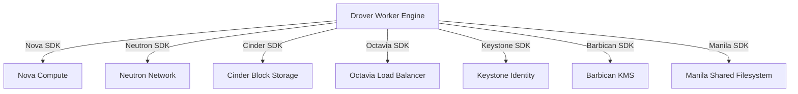

# Drover 레거시 기능 커버리지 및 오픈스택 통합 사양서

본 문서는 레거시 오퍼레이션 및 이전 직접 오픈스택 API 연동 방식 대비 **Drover 서비스의 기능 커버리지, 교체 매핑, 오픈스택 서비스 통합 구조, 보안 아키텍처 및 의도적 제약사항**을 상세히 기술합니다.

**Execution-authority cutover evidence: source-reviewed only.** 기존 테스트의 계약은 test-defined이지 이번 변경의 실행 성공이 아니다. 이 문서 갱신에서는 테스트·live Keystone/OpenStack/K3s 검증을 수행하지 않았다. 역사적 릴리스 문서는 그대로 보존하며 새 모델의 live evidence로 사용하지 않는다.

---

## 1. 레거시 기능 그룹별 교체 및 SDK 매핑 서열 (Feature Replacement Mapping)

Drover는 Magnum REST wire API의 드롭인 대체가 아니라, Afterglow가 직접 URL로 호출하던 K3s 관리 기능을 Keystone catalog 기반 **Drover Native v1 API** 및 Python SDK (`drover-sdk`)로 전환하는 서비스입니다. Catalog service name/type은 모두 `drover`이며, SDK에서 `container-infra`는 alias입니다. 직접 URL에서 catalog로 옮기는 단계와 완료 여부는 [Afterglow 통합 rollout 계획](afterglow-service-integration.md) 및 현재 source를 별도로 확인해야 합니다.

| 기능 그룹 (Functional Group) | 레거시 / 이전 방식 | Drover 네이티브 엔드포인트 교체 사양 | SDK (`drover-sdk`) 매핑 메서드 |
| :--- | :--- | :--- | :--- |
| **클러스터 라이프사이클** | Afterglow의 직접 Drover URL 호출 | `POST /v1/clusters/async`<br>`GET /v1/clusters`<br>`DELETE /v1/clusters/{cluster_id}` | `conn.drover.create_cluster()`<br>`conn.drover.clusters()`<br>`conn.drover.delete_cluster()` |
| **노드 스케일링** | 직접 REST 스케일 요청 | `PATCH /v1/clusters/{cluster_id}/scale`<br>`PATCH /v1/clusters/{cluster_id}/nodegroups/{nodegroup_id}` | `conn.drover.scale_cluster()`<br>`conn.drover.update_nodegroup()` |
| **클러스터 템플릿** | 직접 REST 템플릿 관리 | `GET /v1/cluster-templates`<br>`POST /v1/cluster-templates` | `conn.drover.cluster_templates()`<br>`conn.drover.create_cluster_template()` |
| **K8s 리소스 직접 제어** | 별도 kubectl 또는 직접 REST 호출 | `GET/POST/PUT/DELETE /v1/clusters/{cluster_id}/...` | `conn.drover.configmaps()`<br>`conn.drover.secrets()`<br>`conn.drover.pods()` |
| **인증서 및 CA 관리** | 직접 REST 인증서 호출 | `GET /v1/clusters/{cluster_id}/ca-certificate`<br>`GET /v1/clusters/{cluster_id}/certificate-expiry`<br>`POST /v1/clusters/{cluster_id}/rotate-certs` | `conn.drover.ca_certificate()`<br>`conn.drover.certificate_expiry()`<br>`conn.drover.rotate_certs()` |
| **대화형 클라우드 셸** | 노드 직접 SSH 접속 | `POST /v1/clusters/{cluster_id}/shell-ticket`<br>`WebSocket /v1/clusters/{cluster_id}/shell` | `conn.drover.create_shell_ticket()`<br>(웹브라우저/터미널 전용 WebSocket) |
| **오퍼레이션 트레이싱** | 비동기 상태 유실 위험 | `GET /v1/operations/{operation_id}`<br>`GET /v1/operations/{operation_id}/events` | `conn.drover.get_operation()`<br>`conn.drover.operation_events()` |
| **클러스터 재인가 / owner 회수** | tenant manager authority 교체 | `GET/POST /v1/clusters/{id}/authorization`<br>`POST /v1/clusters/{id}/authorization/retire` | `cluster_authorization()`<br>`reauthorize_cluster()`<br>`retire_cluster_credentials()` |

---

## 2. 오픈스택 서비스별 통합 사양 (OpenStack Service Integrations)

Drover는 클러스터 생성 및 관리를 위해 OpenStack 핵심 서비스들과 직접 통합되어 동적으로 자원을 프로비저닝하고 태그 기반 추적을 수행합니다.


```mermaid
graph TD
    DroverWorker[Drover Worker Engine] -->|Nova SDK| Nova[Nova Compute]
    DroverWorker -->|Neutron SDK| Neutron[Neutron Network]
    DroverWorker -->|Cinder SDK| Cinder[Cinder Block Storage]
    DroverWorker -->|Octavia SDK| Octavia[Octavia Load Balancer]
    DroverWorker -->|Keystone SDK| Keystone[Keystone Identity]
    DroverWorker -->|Barbican SDK| Barbican[Barbican KMS]
    DroverWorker -->|Manila SDK| Manila[Manila Shared Filesystem]
```

### 2.1 Nova (Compute)
- K3s Master (Server) 및 Worker (Agent) 가상머신 프로비저닝.
- 노드 Flavor 검증 및 자원 정책 연동.
- VM 인터페이스 동적 연결/해제 (`POST/DELETE /v1/clusters/{cluster_id}/nodes/{vm_id}/interfaces`).
- 생성된 Nova 서버에는 지원되는 OpenStack 태그/메타데이터로 `drover.managed=true`, `drover.cluster_id=<cluster_id>`, `drover.operation_id=<operation_id>`가 기록되며, 지원하지 않는 자원은 관리 인벤토리의 ID로 추적합니다.

### 2.2 Neutron (Networking)
- 클러스터 전용 Security Group 및 보안 규칙 동적 생성/삭제.
- K3s API Server용 Floating IP (FIP) 및 Port 바인딩.
- `allowed_cidrs` 지정을 통한 K3s API 접근 IP 제어.
- 클러스터 생성의 `network_id`는 외부 Neutron 네트워크에 한정됩니다. 명시 값은 `k3s.default_network`와 같은 검증을 거치고, 생략 시 저장된 필수 정책을 조회·재검증합니다. 내부/공유 전용 네트워크나 누락·만료된 기본 정책은 DB 기록 전에 거부하며 Nova의 자동 네트워크 할당으로 넘어가지 않습니다. 유효한 ID는 cluster/job `network_id` 및 `resource_policy_snapshot["k3s.default_network"]`에 함께 기록되어 초기 서버, HA joiner, agent 및 nodegroup scale에 전달됩니다. [API admission](../drover/api/clusters.py), [카탈로그/검증](../drover/services/resource_policies.py), [policy store](../drover/services/resource_policy_store.py), [직접 VM 경로](../drover/services/provisioner.py), [nodegroup 경로](../drover/services/autoscale.py).
- provider NIC의 `node-ip`·`flannel-iface`·server `advertise-address`는 생성 네트워크 metadata의 MAC을 기준으로 고정되며, 저장된 pin을 재사용하므로 내부 NIC 추가 후 재시작해도 바뀌지 않습니다. 추가 NIC는 Ubuntu에서 DHCP route/DNS 및 IPv6 RA를, FCOS에서 자동 route/DNS 및 IPv6를 차단합니다. Pod 응답용 priority 29999 `to 10.42.0.0/16 table main` 규칙은 K3s `ExecStartPre`가 보장하고 실패 시 시작하지 않으며 watcher가 일시적 손실을 복구합니다. Ubuntu는 해당 규칙만 `protocol kernel`로 지정해 networkd foreign-rule 정리에서 제외합니다(guest에서 watcher 중지 후 provider reconfigure 시 unmarked 삭제·kernel-marked 잔존을 확인); 다른 외부 규칙 수거 정책은 유지합니다. FCOS는 pin된 provider NIC NetworkManager 연결의 영속 `ipv4.routing-rules`(table 254)에 규칙을 등록·reapply합니다. 새 userdata를 통한 전체 cluster 재부팅, FCOS 실제 guest 재구성 및 Pod→API 연결은 아직 확인하지 않았습니다. [pin 및 FCOS 생성](../drover/services/cloudinit.py), [Ubuntu server](../drover/templates/k3s_server.yaml.j2), [Ubuntu agent](../drover/templates/k3s_agent.yaml.j2). 이 userdata 변경은 신규 노드에 적용하며 기존 노드를 자동 재작성하지 않습니다.
- NIC hotplug handler는 모든 udev rule 처리 후 `RUN`에서 최종 `$name`을 사용해 `systemctl --no-block`으로 실행을 요청합니다. rename 전 커널 이름(`eth0`)에 설정을 쓰지 않으며, `ens8` 등 실제 보조 NIC에 route/DNS 차단이 적용됩니다. 정적인 udev rule 검사만으로 완료하지 않고 실제 hotplug·재부팅에서 확인합니다.

### 2.3 Cinder (Block Storage)
- K3s Server VM 부트 볼륨 (`boot_volume_size_gb`, 기본 30GB) 생성 및 가상머신 연결.
- **Cinder CSI Plugin**: 클러스터 내 Kubernetes 볼륨 동적 프로비저닝 지원 (`drover_cinder_csi_enabled: true`).

### 2.4 Octavia (Load Balancing)
- **K3s HA API Load Balancer**: Multi-master (`master_count=3`) 설정 시 K3s Control Plane API (Port 6443) HA 로드밸런서, Listener, Pool 및 Member 생성.
- **OCCM (OpenStack Cloud Controller Manager)**: Kubernetes Ingress / Service Type LoadBalancer 수용 및 Octavia 로드밸런서 자동 동기화 (`drover_occm_enabled: true`).
- OCCM이 활성화되면 server 설치 인자에 `--disable=servicelb`를 넣어 K3s 내장 ServiceLB와 같은 Service status를 경쟁적으로 갱신하지 않습니다. agent 설치 인자에도 `--kubelet-arg=cloud-provider=external`을 넣어 OCCM이 provider ID와 노드 주소를 초기화합니다.
- 생성 provider 네트워크는 OCCM의 `internal-network-name`입니다. 같은 이름이 `k3s.occm_public_network`에도 지정돼 있으면 `public-network-name`을 생략합니다. OCCM의 public 분류는 기존 InternalIP를 삭제하므로 두 역할을 겹치게 렌더링하지 않습니다. 서로 다른 public network 정책과 floating-network 선택은 보존합니다.
- OCCM의 `--cluster-name`은 불변 cluster ID입니다. 클러스터 삭제는 VM 삭제 뒤 `kube_service_<cluster_id>_` 이름과 OCCM 설명(`... from cluster <cluster_id>`)이 모두 일치하는 Service LB를 cascade 삭제하고, OCCM이 만든 설명의 VIP floating IP는 OCCM도 삭제했을 경우에만 함께 삭제합니다. OCCM은 `loadbalancer.openstack.org/keep-floatingip: "true"` Service의 FIP를 남기므로, 삭제는 노드·VM을 건드리기 전에 모든 namespace의 Service annotation을 읽고 LB를 쓰는 Service(생성자 또는 `load-balancer-id` 공유자) 중 하나라도 keep을 요청하면 FIP를 남깁니다. Kubernetes를 읽지 못했거나 LB의 Service가 없으면 의사를 알 수 없으므로 FIP를 남기고 LB 삭제로 연결만 해제합니다. 사용자 지정 FIP, 다른 cluster·사용자 LB와 octavia-ingress LB는 대상이 아닙니다. pending LB는 Octavia가 ACTIVE/ERROR로 정리한 뒤 삭제합니다.
- HA joiner(server 2·3)는 OCCM/CSI의 `cloud.conf`를 재렌더링하지 않고 server 1의 `kube-system/cloud-config` Secret을 공유합니다. Barbican KMS host 파일은 저장된 active guest credential로 각 joiner에 별도 렌더링합니다. control/guest secret은 이제 DB에 암호화 저장됩니다.

### 2.5 Keystone (Identity & Access)
- 사용자 요청 시 호출자의 `X-Auth-Token`을 검증하고 프로젝트 스코프를 확인합니다. 프로젝트 헤더가 없으면 제출된 토큰 범위를 보존합니다.
- 서비스 자격으로 catalog의 `identity` internal endpoint를 해석하여 토큰 introspection, 명시적 rescope 및 관리자 역할 조회를 보냅니다. internal endpoint가 없거나 연결할 수 없으면 external/public endpoint로 fallback하지 않고 fail closed 합니다.
- VM 내부 플러그인은 별도 경계입니다. `provisioner._guest_plugin_settings`가 admitted operation session의 region별 `identity` public endpoint를 guest-only Settings copy에 적용합니다. backend internal 설정과 resource snapshot은 보존하며 플러그인 없는 생성은 catalog 조회를 하지 않습니다. 필요한 endpoint 누락/잘못된 URL은 자원 생성 전에 실패합니다.
- 서비스 카탈로그 자동 등록 (`deploy/kolla/ansible/roles/drover/tasks/preconditions_keystone.yml`의 `name: drover`, `type: drover`).
- durable mutation은 requester-owned trust(`impersonation=True`)로만 실행합니다. 현재 held role IDs에서 required 모두와 보유한 optional만 위임하며 `admin`/`manager`는 위임하지 않습니다. caller token/password는 persist하지 않습니다. connection마다 enabled principal/project, 현재 operation capability/held roles와 token user/project/trustee/expiry를 검증합니다. token에는 admitted role IDs가 모두 있어야 하고 implied-role 확장은 허용하되 `admin`/`manager` token roles는 거부합니다. terminal authorization은 retry/fallback 없이 실패하고 directory/Keystone 통신 장애는 attempt-fenced retry입니다.
- callback 후속 HA/agent와 같은 create operation rollback은 create delegation을 재사용합니다. idle이면 local `released`로 전환하고 job 종료 후와 300초 sweep에서 released/revoked trust를 자신의 impersonating trust-scoped password token으로 DELETE합니다(project selector 없음). 성공/404는 `deleted`, Unauthorized/Forbidden은 released/revoked와 `trust inert until expiry`, 통신 장애는 다음 sweep 재시도입니다. expiry 뒤 Keystone GET 404를 확인하면 `expired`입니다. finite TTL은 DELETE 불가/장애 시 fallback bound이지 정상 완료 trust를 expiry까지 남기는 기본 경로가 아닙니다. 미커밋 admission은 caller token으로 정리합니다.
- user-owned restricted(`unrestricted=False`) control과 별도 guest app credential은 caller token으로 발급하고 암호화 저장합니다. control은 Drover 전용, guest는 OCCM/Cinder CSI/Manila/Octavia Ingress/Barbican KMS 설정용이며 service password/control credential을 guest에 넣지 않습니다. 생성 필요 여부는 `cluster_authority.GUEST_PLUGIN_NAMES` 및 활성 plugin 설정을 따릅니다.
- [Keystone master trusts API](https://github.com/openstack/keystone/blob/master/keystone/api/trusts.py)의 `_check_delegated_token`은 ordinary trust-scoped token을 막지 않습니다. `identity:delete_trust`는 admin/trustor를 허용하고 impersonating trust token의 user는 trustor이므로 Drover가 trust 자체 token으로 DELETE할 수 있습니다. app-credential/OAuth/EC2 trust 관리 차단은 별개입니다. [Master users API](https://github.com/openstack/keystone/blob/master/keystone/api/users.py)의 `_block_delegated_token_app_creds`는 trust/OAuth/EC2의 app-credential create/read/list/delete를 막고 `_check_unrestricted_application_credential`은 restricted app credential의 추가 credential 관리를 막습니다. app credential은 owner의 non-delegated token으로 회수하며 다른-owner secret은 지우고 backlog로 보고합니다. 배포 Keystone 정책은 미검증입니다. `tests/test_native_trust_loopback.py`의 실제 keystoneauth1/keystoneclient HTTP create/project-less OS-TRUST auth/DELETE/revoked-role 경계는 synthetic provider의 test-defined 계약이며 여기서 실행한 결과가 아닙니다.

### 2.6 Barbican & Manila (선택적 커스텀 연동)
- **Barbican KMS Plugin**: K3s Secret 암호화를 위한 KMS 바인딩 지원.
- **Manila CSI Plugin**: K3s Pod 공유 파일시스템(NFS/CephFS) 볼륨 프로비저닝 연동 (`drover_manila_csi_enabled`).
- `barbican.ensure_project_kek(conn)`는 admitted operation connection으로 project 공유 `afterglow-k8s-kek`를 조회하거나 order를 발급하며 tenant manager를 만들지 않습니다. guest KMS는 guest credential을 사용합니다. 기본 `member`로 Barbican 요청이 허용되고 optional `load-balancer_member`가 Octavia에 충분하다는 해석은 **[INFERENCE]**입니다. 실제 cloud policy/KEK ACL을 검증해야 하며 여기서는 live-verified가 아닙니다.

---

## 3. 배포 아키텍처 및 스키마 준비성 (Deployment & Schema Readiness)

Drover는 **Kolla-Ansible** 컨테이너 배포 환경을 표준으로 지원합니다.

```
drover wheel
└── share/kolla-ansible/ansible/roles/drover/
    ├── defaults/main.yml     # Kolla 기본 포트, 이미지, 시크릿 경로 설정
    ├── tasks/
    │   ├── bootstrap_service.yml # MariaDB 데이터베이스 및 계정 생성과 migration 실행
    │   ├── config.yml            # drover.conf/policy.yaml 렌더링
    │   ├── preconditions_keystone.yml # Keystone service catalog 등록
    │   └── deploy.yml            # API/Worker container lifecycle
    └── templates/
        ├── drover.conf.j2        # Drover 메인 구성 파일 템플릿
        ├── drover-api.json.j2    # Kolla config_files 템플릿
        ├── drover-worker.json.j2 # Worker 컨테이너 템플릿
        └── drover-migrate.json.j2# Pre-start Migration 컨테이너 템플릿
```

소스 role은 `deploy/kolla/ansible/roles/drover`에 있으며 root `drover` wheel의 shared data로 설치됩니다. 기본 wheel은 Kolla-Ansible 및 API/Worker runtime dependency를 포함하지 않으며 서비스에는 `drover[service]` extra가 필요합니다. `drover_image_tag` 기본값은 발행 tag `v0.4.4`입니다(`defaults/main.yml`). 실제 GHCR 발행/digest 확인 없이 소스 기본값만으로 배포 완료를 판단하지 않습니다. source-build pin과 SDK 버전(`0.2.21`)은 독립적입니다. 역사적 릴리스 문서는 새 execution-authority cutover의 검증 증거가 아닙니다.

### Schema Readiness 및 Pre-start Migration
- API/Worker보다 `drover-migrate`를 먼저 실행하여 manifest checksum ledger의 001–004를 적용합니다. `004_execution_authority.sql`은 delegations, control/guest credential generations, job delegation FK와 `reauthorize` operation kind를 추가합니다. 기존 manager rows/password는 authority로 전환하지 않습니다. [004 upgrade runbook](../drover/migrations/README.md#execution-authority-upgrade-004)을 따릅니다.
- API 서버는 요청 수신 시 DB 마이그레이션이 완전히 적용되지 않았거나 Redis/Keystone 커넥션이 정상화되지 않은 경우 `/v1/health/ready`에서 HTTP 503을 반환하여 트래픽 입입을 방지합니다.

---

## 4. 보안, 인프라 동기화 및 오토스케일링 아키텍처

### 4.1 보안 아키텍처 (Security Architecture)
* **비밀번호 분리 및 마스킹**: 비밀번호, 암호화 키 등 민감한 데이터는 환경변수나 소스코드에 하드코딩되지 않으며, `/etc/drover/secrets/*` 파일 경로를 통해 읽어옵니다. 관리자 인벤토리 API(`GET /v1/admin/managed-resources`)는 시크릿 패턴을 자동으로 정규식 검사하여 마스킹 처리합니다.
* **cloud-init 보안**: guest 플러그인에는 caller-owned restricted guest Application Credential만 넣고 service password/control credential은 넣지 않습니다. control/guest secret은 DB에서 전용 `cluster_app_credential` AES-GCM domain으로 암호화 저장하며 세대 교체 시 retiring secret을 지웁니다.
* **Callback CIDR 제한**: K3s Server cloud-init이 호출하는 `/v1/callback` 엔드포인트는 `drover_callback_allowed_cidrs` 허용목록에 등록된 IP 범위에서만 접근할 수 있도록 소스 IP 레벨에서 차단 검증합니다.

### 4.2 인프라 동기화 (Reconciliation Loop)
- **Worker Periodic Scan**: `drover-worker` 엔진은 설정된 주기(`drover_reconcile_interval`)마다 오픈스택 실제 자원(`ManagedOpenStackResource`) 상태와 DB의 원하는 클러스터 상태를 교차 검증합니다.
- **Orphan & Drift Detection**: OpenStack 자원이 임의 삭제되었거나 갱신된 경우 `drift_status` 및 `last_reconciled_at` 필드를 업데이트하고 클러스터를 경고/ERROR 상태로 전환합니다.
- **Application Credential 소유자**: active generation credential ID와 control connection의 `current_user_id`로 user-scoped SDK GET을 사용합니다. historic manager-owned inventory는 건너뛰고 retiring backlog로 다룹니다. 404만 missing이고 인증·연결 장애는 missing으로 숨기지 않습니다. owner의 get capability와 token role IDs(implied-role 확장 허용, admin/manager 금지)를 매 connection에 확인합니다. periodic scan은 active control cluster만 대상으로 하고 legacy explicit reconcile은 `reauthorization_required`입니다. credential missing은 non-required drift이고 reconcile job의 authority failure도 그 자체로 cluster를 ERROR로 만들지 않아 ACTIVE-only 재인가를 차단하지 않습니다.

### 4.3 Stampede 오토스케일링 (Autoscaling)
- **실행 권한**: planner와 Stampede job은 active control credential owner의 현재 `drover:clusters:scale`을 재검증합니다. revoked owner/role은 `authority_revoked`, active control 없는 legacy cluster는 `reauthorization_required`로 차단합니다. Stampede enable도 active control이 없으면 409입니다. health Nova lookup은 `drover:clusters:get` capability를 사용하며 실패 시 private-IP 경로를 유지하고 service identity로 우회하지 않습니다.
- **Pod Request 기반 스케일링**: Kubernetes API의 Pod requests(CPU millicores, RAM bytes, NVIDIA GPU slots, extended resources)를 노드의 allocatable 용량과 직접 대조하여 부족분을 산정합니다. PVC 바인딩 지연, 고정 노드 지정, unsupported pod affinity/topology spread/host port 등 비용량적 원인으로 pending된 Pod는 워커 증설을 유발하지 않습니다.
- **GPU 워커 부트스트랩 및 가용성 검증**: 명시적 GPU flavor를 사용하는 노드그룹은 agent userdata에 `--default-runtime=nvidia` 및 `afterglow.io/gpu=true` 라벨을 주입하고, Ubuntu에서는 NVIDIA container toolkit을 설치하며 FCOS에서는 드라이버/런타임이 사전 탑재된 이미지를 사용합니다. Drover가 클러스터에 `afterglow-nvidia-device-plugin` DaemonSet을 배포하며, K3s 노드가 `Ready` 상태가 되는 것뿐만 아니라 `nvidia.com/gpu` allocatable이 실제 관측될 때까지 대기한 후 내구성 작업을 성공 처리합니다.
- **GPU 실패 분류**: Ready 미달은 GPU flavor에서도 `node_not_ready`이며, Ready 이후 실제 요청한 디바이스 수가 부족한 경우만 `gpu_not_allocatable`입니다. 부분 VM 생성은 `provision_failed`가 우선합니다(`stampede.py:_provision_and_track`).
- **원자적 예약 및 Fencing**: 수동 변경과 오토스케일러의 증설/축소 요청은 MariaDB 트랜잭션 내에서 row lock(`with_for_update`)과 함께 durable job(`stampede_provision`, `nodegroup_reconcile`)을 큐잉합니다. `in_flight_count`로 중복 증설을 차단하고 작업 종료 시 DB의 실제 VM 인벤토리를 기준으로 `node_count`를 동기화합니다.
- **안정화 윈도우 및 안전한 Drain/축소**: 노드그룹의 사용률이 임계값(`drover_stampede_scale_down_threshold`, 기본 0.5) 미만으로 300–600초(`drover_stampede_scale_down_window`) 동안 지속되고 `min_size`를 초과할 때만 축소 후보를 선정합니다. 후보 노드의 모든 Pod가 남은 활성 스케줄 가능 노드로 안전하게 재배치(relocate) 가능한지(컨트롤러 유무, PVC, 로컬 스토리지, PDB 준수) 검증한 후 1개씩 축소합니다. 삭제 직전 live pending Pod, Ready, min-size headroom을 Nova ID 조회로 재검증하며 실제 404만 absent로 봅니다(403/400 등 관측 오류는 정리를 허가하지 않음). cordon은 Node annotation `drover.io/removing-vm-id`를 함께 기록합니다. drain 실패나 DELETE 직전 최종 Nova 조회·소유권 재검증 실패 시에는 이번 시도가 새로 건 cordon만 해제하고 리소스를 보존합니다. 이전 시도에서 남은 같은 VM annotation cordon은 DELETE 이후일 수 있어 해제하지 않습니다. 최종 재검증 뒤에는 DELETE 거부나 정리 실패가 있어도 cordon을 유지하고, 재시도는 같은 VM annotation의 자기 cordon만 재개합니다. Nova VM 소멸이 확인된 후에만 boot volume, Kubernetes Node, tracking row를 순차 정리합니다.
- **미등록 worker 수동 삭제**: 전체 Node 조회가 성공한 경우에만 없는 이름을 cordoned Node로 POST 예약하고 정상 drain·최종 Nova 재검증을 거칩니다. POST 201 외 응답과 통신 실패는 삭제를 중단하며 예약은 rollback으로 uncordon하지 않습니다. 자동 축소의 Ready/min-size guard는 그대로입니다(`autoscale.py:delete_nodegroup_vms`, `kube.py:cordon_node`).
---

## 5. 의도적인 설계 제약사항 (Intentional Non-Goals)

Drover 서비스의 아키텍처 단순화와 성능 최적화를 위해 아래 기능은 **의도적으로 지원하지 않는 범위(Non-Goals)**로 규정되었습니다:

1. **OpenStack Magnum Wire API 호환성 미지원**
   - Magnum의 기존 `/v1/clusters` REST JSON 포맷을 드롭인 대체(Drop-in replacement)하지 않습니다.
   - 모든 통합 클라이언트는 Drover Native `/v1` API 및 `drover-sdk` 라이브러리를 사용해야 합니다.

2. **OpenStack Placement API 직접 할당 연동 미지원**
   - Placement 서비스의 Resource Class 직접 커스텀 allocation 할당을 사용하지 않습니다.
   - Placement 직접 allocation을 사용하지 않고 Nova Flavor 스케줄링을 따릅니다. `drover_afterglow_admission_url` 설정 시 Stampede planner는 Afterglow admission을 검사하며 `autoscale.provision_nodegroup_vms`는 **각 새 native GPU worker create 전** 다시 admission을 검사합니다(기존 VM 복구는 새 create가 아님). denial/unavailability/transport 실패는 fail closed 입니다. Afterglow는 live Nova usage를 세므로 이 판정은 quota reservation이 아닙니다. URL 미설정 환경은 Nova flavor/native project quota로 직접 생성합니다. Afterglow provisioning intents와 그 설정은 제거됐습니다.

---

## 6. 코드 상 발견된 구현 주의사항 (Implementation Caveats)

1. **내구성 오퍼레이션 (`DroverOperation`) 기록**
   - 클러스터 생성/스케일/삭제 등 라이프사이클 변경 시, 비동기 작업 시작 직후 DB 내 `DroverOperation` 행과 `DroverJob`이 동일 트랜잭션으로 생성됩니다.
2. **SSE 연결 중단과 백그라운드 작업 분리**
   - create 등 내구성 Job 기반 SSE가 끊겨도 Worker 작업은 계속됩니다. 현재 tenant `POST /v1/clusters/{id}/delete-async`는 caller connection으로 직접 실행하며 caller-owned credential도 이 connection으로 회수합니다. durable trust/job 또는 disconnect 이후 실행 보장은 없고 creator identity fallback도 없습니다. durable tenant DELETE/admin delete와 구분합니다. SDK는 operation polling helper를 제공하며 모든 SSE를 자동으로 polling 복구한다고 보장하지 않습니다.
3. **일회성 콜백 토큰 (`GETDEL`)**
   - cloud-init이 수신하는 Redis 콜백 토큰은 30분 유효기간을 가지며, 1회 조회 시 즉시 삭제(`GETDEL`)되므로 재사용이 불가능합니다.


### Resource authority 재인가·삭제·upgrade

- `POST /v1/clusters/{id}/authorization`은 현재 `drover:clusters:reauthorize` operator의 caller token으로 credentials를 발급하고, `ACTIVE`이며 다른 mutation이 없는 cluster에 staged generation + durable job을 기록합니다. 202 응답의 operation ID를 poll해야 합니다. 신규 생성 generation 1은 active로 저장하지만 재인가는 rollout 성공 전에 active로 바꾸지 않습니다.
- worker는 reauthorize capability 및 staged credential token을 확인합니다. 기존 guest가 있거나 legacy guest를 대체할 때 `kube-system/cloud-config`, `manila-cloud-secret` Secret과 `octavia-ingress-controller-config` ConfigMap의 credential keys만 교체합니다. 참조하는 Deployment/DaemonSet/StatefulSet을 restart하고 observed generation/updated/available(또는 ready)/revision으로 rollout 완료를 기다립니다.
- KMS required 또는 legacy detect 모드는 각 control-plane host에 privileged hostPID Job을 실행합니다. temporary Secret에서 env로 받은 credential을 `nsenter`로 `/etc/kubernetes/cloud.conf`(있으면)와 `/etc/kubernetes/barbican-cloud.conf`에 rewrite하고 `barbican-kms.service`를 restart해 active/socket을 확인합니다. detect 모드만 없는 KMS 파일을 허용합니다. 모든 rollout 뒤 Secret-write probe 성공이 activation의 선행 조건입니다.
- 성공한 generation은 atomic active, 이전 active/다른 staged는 retiring과 secret erasure입니다. 부분 실패는 staged `last_error`와 기존 active를 유지하며 이미 수정된 guest 객체를 자동 복구한다는 보장은 없습니다. `GET .../authorization`은 secret 없이 states/backlog를 반환하고 `POST .../authorization/retire`는 caller 소유 retiring credential만 owner token으로 삭제합니다. legacy owner 없는 credential은 operator 회수 대상입니다.
- cluster 삭제는 현재 delete actor의 trust로 실행해 creator가 없어도 가능합니다. tenant admission은 caller 소유 credential을 caller token으로 동기 삭제 시도하고, 완료 시 다른 owner/legacy의 secret을 지워 `owner_revocation_required`로 보고합니다. 모든 원격 credential이 함께 폐기됐다는 보장은 없습니다.
- upgrade 순서: 004 적용 → 구 worker로 pre-upgrade mutation/callback drain → 새 API/Worker → legacy ACTIVE cluster 재인가/rollout 성공 → `afterglow-cluster-mgr-*` 사용자와 옛 credential을 out of band 제거. 자세한 절차는 [migration README](../drover/migrations/README.md#execution-authority-upgrade-004)를 참조합니다.

`[drover]` 설정은 `operation_trust_ttl_seconds`(14400, 900–86400), `operation_trust_min_remaining_seconds`(300, 60–3600 및 TTL보다 작음), `delegated_required_roles`(["member"], nonempty), `delegated_optional_roles`(["load-balancer_member"], 보유할 때만), `guest_rollout_timeout_seconds`(600, 60–3600)입니다. Settings/Kolla 이름은 `drover_` prefix입니다. `drover_afterglow_provisioning_url`, `drover_afterglow_provisioning_token`, `drover_afterglow_provisioning_token_file` 및 `DROVER_AFTERGLOW_PROVISIONING_TOKEN_FILE`은 제거됐습니다. Kolla도 같은 provisioning 변수를 제거했고 `afterglow_k3s_provisioning_token` 파일을 `state: absent`로 정리합니다. admission 설정/파일은 유지됩니다.
---

## 상호 문서 참조
* [Drover 기술 문서 인덱스](README.md)
* [Afterglow 서비스 통합 가이드](afterglow-service-integration.md)
* [Drover Native v1 API 기술 Reference](drover-api-v1-reference.md)
